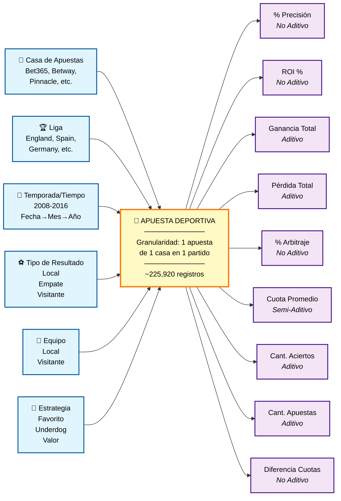
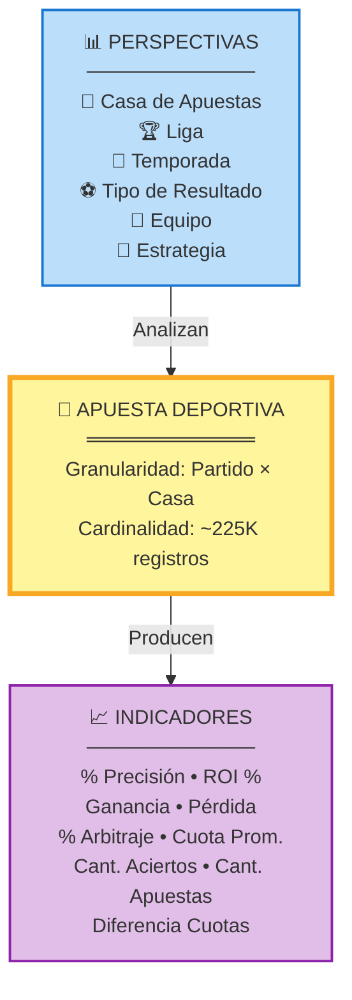
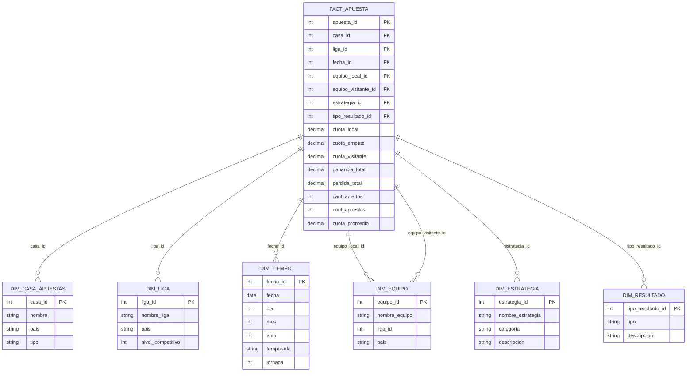
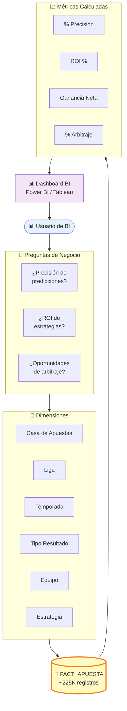
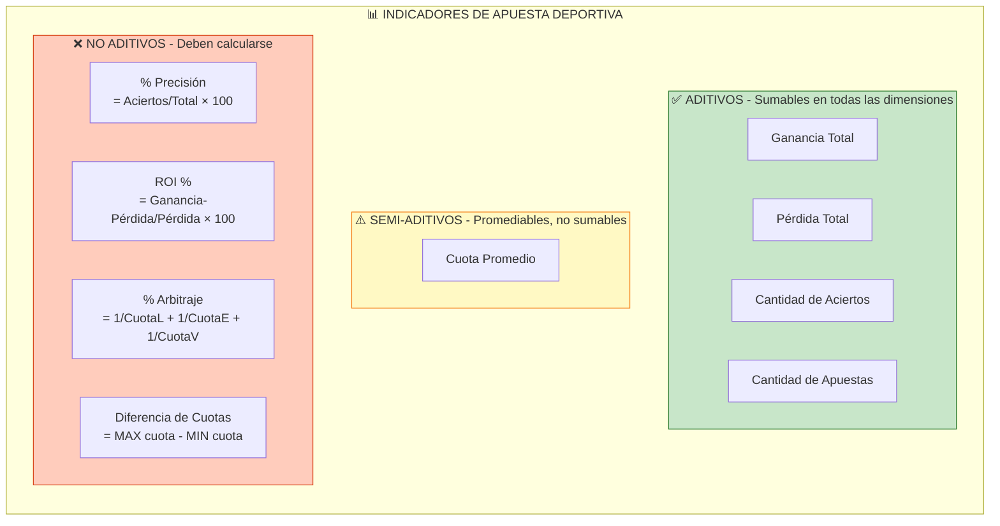

# Modelo Conceptual HEFESTO - Sistema de Apuestas Deportivas

## Diagrama Mermaid - Modelo Conceptual

### Versión 1: Modelo Conceptual Completo (Horizontal)



---

### Versión 2: Modelo Simplificado (Vertical)



---

### Versión 3: Esquema Estrella (Star Schema)



---

### Versión 4: Jerarquías Dimensionales

```mermaid
graph TD
    %% Estilos
    classDef level1 fill:#c8e6c9,stroke:#2e7d32,stroke-width:2px
    classDef level2 fill:#a5d6a7,stroke:#388e3c,stroke-width:2px
    classDef level3 fill:#81c784,stroke:#43a047,stroke-width:2px
    classDef level4 fill:#66bb6a,stroke:#4caf50,stroke-width:2px

    subgraph JERARQUIA_TIEMPO["📅 Jerarquía Temporal"]
        T1[Fecha]:::level1
        T2[Mes]:::level2
        T3[Año]:::level3
        T4[Temporada]:::level4

        T1 --> T2
        T2 --> T3
        T3 --> T4
    end

    subgraph JERARQUIA_GEOGRAFICA["🌍 Jerarquía Geográfica"]
        G1[Equipo]:::level1
        G2[Liga]:::level2
        G3[País]:::level3

        G1 --> G2
        G2 --> G3
    end

    subgraph JERARQUIA_RESULTADO["⚽ Jerarquía Resultado"]
        R1[Resultado Específico<br/>ej: 2-1, 3-0]:::level1
        R2[Tipo de Resultado<br/>Local/Empate/Visitante]:::level2

        R1 --> R2
    end

    subgraph JERARQUIA_CASA["🏢 Jerarquía Casa de Apuestas"]
        C1[Casa Individual]:::level1
        C2[Región Geográfica]:::level2
        C3[Tipo de Operador]:::level3

        C1 --> C2
        C2 --> C3
    end
```



---

### Versión 5: Flujo de Análisis OLAP



---

### Versión 6: Clasificación de Indicadores por Tipo



---

### Versión 7: Mapeo Fuente → Destino (ETL)

```mermaid
flowchart LR
    subgraph OLTP["💾 Fuente OLTP<br/>(database.sqlite)"]
        T1[(Match<br/>25,979 rows)]
        T2[(Team<br/>~300 rows)]
        T3[(League<br/>11 rows)]
        T4[(Country<br/>11 rows)]
        T5[(Player<br/>11,060 rows)]
    end

    subgraph ETL["⚙️ Proceso ETL"]
        E1[Extract]
        E2[Transform<br/>────<br/>Limpiar<br/>Derivar<br/>Enriquecer]
        E3[Load]

        E1 --> E2 --> E3
    end

    subgraph DW["🏛️ Data Warehouse<br/>(Esquema Estrella)"]
        F[(FACT_APUESTA<br/>~225K rows)]
        D1[(DIM_CASA<br/>10 rows)]
        D2[(DIM_LIGA<br/>11 rows)]
        D3[(DIM_TIEMPO<br/>~3K rows)]
        D4[(DIM_EQUIPO<br/>~300 rows)]
        D5[(DIM_ESTRATEGIA<br/>~5 rows)]
        D6[(DIM_RESULTADO<br/>3 rows)]
    end

    T1 --> E1
    T2 --> E1
    T3 --> E1
    T4 --> E1
    T5 --> E1

    E3 --> F
    E3 --> D1
    E3 --> D2
    E3 --> D3
    E3 --> D4
    E3 --> D5
    E3 --> D6

    style T1 fill:#bbdefb
    style F fill:#fff9c4,stroke:#f57f17,stroke-width:3px
    style E2 fill:#c8e6c9
```



---

## Cómo Visualizar estos Diagramas

### Opción 1: GitHub / GitLab
Los diagramas Mermaid se renderizan automáticamente en archivos `.md` en GitHub y GitLab.

### Opción 2: Visual Studio Code
Instalar extensión: **Markdown Preview Mermaid Support**
```bash
code --install-extension bierner.markdown-mermaid
```

### Opción 3: Mermaid Live Editor
Visitar: https://mermaid.live/
- Copiar el código Mermaid
- Pegar en el editor
- Exportar como PNG/SVG/PDF

### Opción 4: Herramientas Online
- **Mermaid Chart**: https://www.mermaidchart.com/
- **Draw.io**: Soporta importación Mermaid
- **Notion**: Renderiza Mermaid en bloques de código

### Opción 5: Exportar a Imagen
```bash
# Instalar Mermaid CLI
npm install -g @mermaid-js/mermaid-cli

# Convertir a PNG
mmdc -i modelo_conceptual_hefesto.md -o diagrama.png

# Convertir a SVG
mmdc -i modelo_conceptual_hefesto.md -o diagrama.svg

# Convertir a PDF
mmdc -i modelo_conceptual_hefesto.md -o diagrama.pdf
```

---

## Descripción de las Versiones

| Versión | Tipo de Diagrama | Mejor Para | Complejidad |
|---------|------------------|------------|-------------|
| **V1** | Graph Horizontal | Presentaciones ejecutivas | Media |
| **V2** | Graph Vertical Simplificado | Documentación rápida | Baja |
| **V3** | ER Diagram (Esquema Estrella) | Implementación técnica | Alta |
| **V4** | Jerarquías Dimensionales | Diseño OLAP | Media |
| **V5** | Flujo de Análisis | Casos de uso BI | Media |
| **V6** | Clasificación de Indicadores | Diseño de métricas | Baja |
| **V7** | Mapeo ETL | Desarrollo ETL | Alta |

---

## Recomendación de Uso

### Para Stakeholders de Negocio:
- **Usar:** Versión 2 (Simplificado) o Versión 5 (Flujo de Análisis)
- **Formato:** PNG exportado con colores claros
- **Incluir:** Leyenda explicativa

### Para Arquitectos de Datos:
- **Usar:** Versión 3 (Esquema Estrella) y Versión 7 (ETL)
- **Formato:** SVG editable o código Mermaid
- **Incluir:** Tipos de datos y cardinalidades

### Para Desarrolladores BI:
- **Usar:** Versión 1 (Completo) y Versión 6 (Indicadores)
- **Formato:** Código Mermaid integrado en documentación
- **Incluir:** Fórmulas de cálculo

### Para Presentaciones:
- **Usar:** Versión 5 (Flujo) como storytelling
- **Formato:** PDF de alta resolución
- **Incluir:** Animaciones en PowerPoint

---

## Ventajas de Mermaid

✅ **Versionable:** Se guarda como texto en Git
✅ **Editable:** Fácil modificación sin herramientas gráficas
✅ **Portable:** Funciona en múltiples plataformas
✅ **Integrable:** Compatible con Markdown, Confluence, Notion
✅ **Automatizable:** Se puede generar programáticamente
✅ **Gratuito:** No requiere licencias de software

---

## Integración con README.md

Para incluir estos diagramas en el README principal:

```markdown
## Modelo Conceptual Visual

### Esquema Estrella Completo

\`\`\`mermaid
[Copiar código de Versión 3]
\`\`\`

### Jerarquías Dimensionales

\`\`\`mermaid
[Copiar código de Versión 4]
\`\`\`
```

---

## Exportación Automática con Script

```python
# export_mermaid_diagrams.py
import os
import subprocess

diagrams = [
    "version1_completo",
    "version2_simplificado",
    "version3_estrella",
    "version4_jerarquias",
    "version5_flujo",
    "version6_indicadores",
    "version7_etl"
]

for diagram in diagrams:
    input_file = f"{diagram}.mmd"
    output_file = f"{diagram}.png"

    cmd = f"mmdc -i {input_file} -o {output_file} -b transparent -w 1920"
    subprocess.run(cmd, shell=True)

    print(f"✅ Exportado: {output_file}")
```

---

## Metadatos del Documento

- **Archivo:** modelo_conceptual_hefesto.md
- **Versión:** 1.0
- **Fecha:** 2025-10-22
- **Formato:** Markdown + Mermaid
- **Diagramas:** 7 versiones diferentes
- **Proyecto:** Sistema de Apuestas Deportivas - Data Warehouse
- **Metodología:** HEFESTO - Paso 1

---

**📌 Nota:** Este archivo contiene múltiples representaciones del mismo modelo conceptual para diferentes audiencias y propósitos. Selecciona la versión más adecuada para tu contexto específico.
