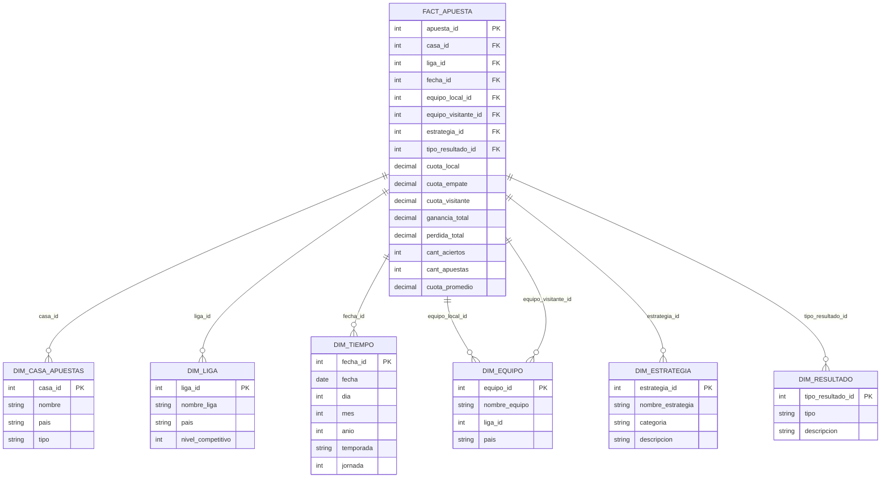

# Modelo Conceptual HEFESTO - Sistema de Apuestas Deportivas

## Diagrama Mermaid - Modelo Conceptual

### Versión 1: Modelo Conceptual Completo (Horizontal)

```mermaid
graph LR
    %% Definición de estilos
    classDef perspectiva fill:#e1f5ff,stroke:#01579b,stroke-width:2px,color:#000
    classDef hecho fill:#fff9c4,stroke:#f57f17,stroke-width:3px,color:#000
    classDef indicador fill:#f3e5f5,stroke:#4a148c,stroke-width:2px,color:#000

    %% PERSPECTIVAS (Dimensiones)
    P1[🏢 Casa de Apuestas<br/>Bet365, Betway,<br/>Pinnacle, etc.]:::perspectiva
    P2[🏆 Liga<br/>England, Spain,<br/>Germany, etc.]:::perspectiva
    P3[📅 Temporada/Tiempo<br/>2008-2016<br/>Fecha→Mes→Año]:::perspectiva
    P4[⚽ Tipo de Resultado<br/>Local<br/>Empate<br/>Visitante]:::perspectiva
    P5[👥 Equipo<br/>Local<br/>Visitante]:::perspectiva
    P6[🎯 Estrategia<br/>Favorito<br/>Underdog<br/>Valor]:::perspectiva

    %% HECHO CENTRAL (Proceso de Negocio)
    H[🎲 APUESTA DEPORTIVA<br/>────────────<br/>Granularidad: 1 apuesta<br/>de 1 casa en 1 partido<br/>────────────<br/>~225,920 registros]:::hecho

    %% INDICADORES (Métricas)
    I1[% Precisión<br/><i>No Aditivo</i>]:::indicador
    I2[ROI %<br/><i>No Aditivo</i>]:::indicador
    I3[Ganancia Total<br/><i>Aditivo</i>]:::indicador
    I4[Pérdida Total<br/><i>Aditivo</i>]:::indicador
    I5[% Arbitraje<br/><i>No Aditivo</i>]:::indicador
    I6[Cuota Promedio<br/><i>Semi-Aditivo</i>]:::indicador
    I7[Cant. Aciertos<br/><i>Aditivo</i>]:::indicador
    I8[Cant. Apuestas<br/><i>Aditivo</i>]:::indicador
    I9[Diferencia Cuotas<br/><i>No Aditivo</i>]:::indicador

    %% RELACIONES: Perspectivas → Hecho
    P1 --> H
    P2 --> H
    P3 --> H
    P4 --> H
    P5 --> H
    P6 --> H

    %% RELACIONES: Hecho → Indicadores
    H --> I1
    H --> I2
    H --> I3
    H --> I4
    H --> I5
    H --> I6
    H --> I7
    H --> I8
    H --> I9
```



---

### Versión 2: Modelo Simplificado (Vertical)

```mermaid
graph TD
    %% Estilos
    classDef dim fill:#bbdefb,stroke:#1976d2,stroke-width:2px
    classDef fact fill:#fff59d,stroke:#f9a825,stroke-width:4px
    classDef measure fill:#e1bee7,stroke:#8e24aa,stroke-width:2px

    %% Dimensiones agrupadas
    DIMS[📊 PERSPECTIVAS<br/>────────────<br/>🏢 Casa de Apuestas<br/>🏆 Liga<br/>📅 Temporada<br/>⚽ Tipo de Resultado<br/>👥 Equipo<br/>🎯 Estrategia]:::dim

    %% Hecho central
    FACT[🎲 APUESTA DEPORTIVA<br/>════════════<br/>Granularidad: Partido × Casa<br/>Cardinalidad: ~225K registros]:::fact

    %% Indicadores agrupados
    MEAS[📈 INDICADORES<br/>────────────<br/>% Precisión • ROI %<br/>Ganancia • Pérdida<br/>% Arbitraje • Cuota Prom.<br/>Cant. Aciertos • Cant. Apuestas<br/>Diferencia Cuotas]:::measure

    %% Relaciones
    DIMS -->|Analizan| FACT
    FACT -->|Producen| MEAS
```



---

### Versión 3: Esquema Estrella (Star Schema)



---

### Versión 4: Jerarquías Dimensionales

```mermaid
graph TD
    %% Estilos
    classDef level1 fill:#c8e6c9,stroke:#2e7d32,stroke-width:2px
    classDef level2 fill:#a5d6a7,stroke:#388e3c,stroke-width:2px
    classDef level3 fill:#81c784,stroke:#43a047,stroke-width:2px
    classDef level4 fill:#66bb6a,stroke:#4caf50,stroke-width:2px

    subgraph JERARQUIA_TIEMPO["📅 Jerarquía Temporal"]
        T1[Fecha]:::level1
        T2[Mes]:::level2
        T3[Año]:::level3
        T4[Temporada]:::level4

        T1 --> T2
        T2 --> T3
        T3 --> T4
    end

    subgraph JERARQUIA_GEOGRAFICA["🌍 Jerarquía Geográfica"]
        G1[Equipo]:::level1
        G2[Liga]:::level2
        G3[País]:::level3

        G1 --> G2
        G2 --> G3
    end

    subgraph JERARQUIA_RESULTADO["⚽ Jerarquía Resultado"]
        R1[Resultado Específico<br/>ej: 2-1, 3-0]:::level1
        R2[Tipo de Resultado<br/>Local/Empate/Visitante]:::level2

        R1 --> R2
    end

    subgraph JERARQUIA_CASA["🏢 Jerarquía Casa de Apuestas"]
        C1[Casa Individual]:::level1
        C2[Región Geográfica]:::level2
        C3[Tipo de Operador]:::level3

        C1 --> C2
        C2 --> C3
    end
```



---

### Versión 5: Flujo de Análisis OLAP

```mermaid
flowchart TD
    START([📊 Usuario de BI])

    subgraph PREGUNTAS["🎯 Preguntas de Negocio"]
        Q1[¿Precisión de<br/>predicciones?]
        Q2[¿ROI de<br/>estrategias?]
        Q3[¿Oportunidades<br/>de arbitraje?]
    end

    subgraph DIMENSIONES["📐 Dimensiones"]
        D1[Casa de Apuestas]
        D2[Liga]
        D3[Temporada]
        D4[Tipo Resultado]
        D5[Equipo]
        D6[Estrategia]
    end

    FACT[(🎲 FACT_APUESTA<br/>~225K registros)]

    subgraph METRICAS["📈 Métricas Calculadas"]
        M1[% Precisión]
        M2[ROI %]
        M3[Ganancia Neta]
        M4[% Arbitraje]
    end

    DASHBOARD[📊 Dashboard BI<br/>Power BI / Tableau]

    START --> PREGUNTAS
    PREGUNTAS --> DIMENSIONES
    DIMENSIONES --> FACT
    FACT --> METRICAS
    METRICAS --> DASHBOARD
    DASHBOARD --> START

    style START fill:#e3f2fd
    style FACT fill:#fff9c4,stroke:#f57f17,stroke-width:3px
    style DASHBOARD fill:#f3e5f5
```



---

### Versión 6: Clasificación de Indicadores por Tipo

```mermaid
graph TD
    subgraph INDICADORES["📊 INDICADORES DE APUESTA DEPORTIVA"]
        direction TB

        subgraph ADITIVOS["✅ ADITIVOS - Sumables en todas las dimensiones"]
            A1[Ganancia Total]
            A2[Pérdida Total]
            A3[Cantidad de Aciertos]
            A4[Cantidad de Apuestas]
        end

        subgraph SEMI_ADITIVOS["⚠️ SEMI-ADITIVOS - Promediables, no sumables"]
            SA1[Cuota Promedio]
        end

        subgraph NO_ADITIVOS["❌ NO ADITIVOS - Deben calcularse"]
            NA1[% Precisión<br/>= Aciertos/Total × 100]
            NA2[ROI %<br/>= Ganancia-Pérdida/Pérdida × 100]
            NA3[% Arbitraje<br/>= 1/CuotaL + 1/CuotaE + 1/CuotaV]
            NA4[Diferencia de Cuotas<br/>= MAX cuota - MIN cuota]
        end
    end

    style ADITIVOS fill:#c8e6c9,stroke:#2e7d32
    style SEMI_ADITIVOS fill:#fff9c4,stroke:#f57f17
    style NO_ADITIVOS fill:#ffccbc,stroke:#d84315
```



---

### Versión 7: Mapeo Fuente → Destino (ETL)

```mermaid
flowchart LR
    subgraph OLTP["💾 Fuente OLTP<br/>(database.sqlite)"]
        T1[(Match<br/>25,979 rows)]
        T2[(Team<br/>~300 rows)]
        T3[(League<br/>11 rows)]
        T4[(Country<br/>11 rows)]
        T5[(Player<br/>11,060 rows)]
    end

    subgraph ETL["⚙️ Proceso ETL"]
        E1[Extract]
        E2[Transform<br/>────<br/>Limpiar<br/>Derivar<br/>Enriquecer]
        E3[Load]

        E1 --> E2 --> E3
    end

    subgraph DW["🏛️ Data Warehouse<br/>(Esquema Estrella)"]
        F[(FACT_APUESTA<br/>~225K rows)]
        D1[(DIM_CASA<br/>10 rows)]
        D2[(DIM_LIGA<br/>11 rows)]
        D3[(DIM_TIEMPO<br/>~3K rows)]
        D4[(DIM_EQUIPO<br/>~300 rows)]
        D5[(DIM_ESTRATEGIA<br/>~5 rows)]
        D6[(DIM_RESULTADO<br/>3 rows)]
    end

    T1 --> E1
    T2 --> E1
    T3 --> E1
    T4 --> E1
    T5 --> E1

    E3 --> F
    E3 --> D1
    E3 --> D2
    E3 --> D3
    E3 --> D4
    E3 --> D5
    E3 --> D6

    style T1 fill:#bbdefb
    style F fill:#fff9c4,stroke:#f57f17,stroke-width:3px
    style E2 fill:#c8e6c9
```



---

## Cómo Visualizar estos Diagramas

### Opción 1: GitHub / GitLab
Los diagramas Mermaid se renderizan automáticamente en archivos `.md` en GitHub y GitLab.

### Opción 2: Visual Studio Code
Instalar extensión: **Markdown Preview Mermaid Support**
```bash
code --install-extension bierner.markdown-mermaid
```

### Opción 3: Mermaid Live Editor
Visitar: https://mermaid.live/
- Copiar el código Mermaid
- Pegar en el editor
- Exportar como PNG/SVG/PDF

### Opción 4: Herramientas Online
- **Mermaid Chart**: https://www.mermaidchart.com/
- **Draw.io**: Soporta importación Mermaid
- **Notion**: Renderiza Mermaid en bloques de código

### Opción 5: Exportar a Imagen
```bash
# Instalar Mermaid CLI
npm install -g @mermaid-js/mermaid-cli

# Convertir a PNG
mmdc -i modelo_conceptual_hefesto.md -o diagrama.png

# Convertir a SVG
mmdc -i modelo_conceptual_hefesto.md -o diagrama.svg

# Convertir a PDF
mmdc -i modelo_conceptual_hefesto.md -o diagrama.pdf
```

---

## Descripción de las Versiones

| Versión | Tipo de Diagrama | Mejor Para | Complejidad |
|---------|------------------|------------|-------------|
| **V1** | Graph Horizontal | Presentaciones ejecutivas | Media |
| **V2** | Graph Vertical Simplificado | Documentación rápida | Baja |
| **V3** | ER Diagram (Esquema Estrella) | Implementación técnica | Alta |
| **V4** | Jerarquías Dimensionales | Diseño OLAP | Media |
| **V5** | Flujo de Análisis | Casos de uso BI | Media |
| **V6** | Clasificación de Indicadores | Diseño de métricas | Baja |
| **V7** | Mapeo ETL | Desarrollo ETL | Alta |

---

## Recomendación de Uso

### Para Stakeholders de Negocio:
- **Usar:** Versión 2 (Simplificado) o Versión 5 (Flujo de Análisis)
- **Formato:** PNG exportado con colores claros
- **Incluir:** Leyenda explicativa

### Para Arquitectos de Datos:
- **Usar:** Versión 3 (Esquema Estrella) y Versión 7 (ETL)
- **Formato:** SVG editable o código Mermaid
- **Incluir:** Tipos de datos y cardinalidades

### Para Desarrolladores BI:
- **Usar:** Versión 1 (Completo) y Versión 6 (Indicadores)
- **Formato:** Código Mermaid integrado en documentación
- **Incluir:** Fórmulas de cálculo

### Para Presentaciones:
- **Usar:** Versión 5 (Flujo) como storytelling
- **Formato:** PDF de alta resolución
- **Incluir:** Animaciones en PowerPoint

---

## Ventajas de Mermaid

✅ **Versionable:** Se guarda como texto en Git
✅ **Editable:** Fácil modificación sin herramientas gráficas
✅ **Portable:** Funciona en múltiples plataformas
✅ **Integrable:** Compatible con Markdown, Confluence, Notion
✅ **Automatizable:** Se puede generar programáticamente
✅ **Gratuito:** No requiere licencias de software

---

## Integración con README.md

Para incluir estos diagramas en el README principal:

```markdown
## Modelo Conceptual Visual

### Esquema Estrella Completo

\`\`\`mermaid
[Copiar código de Versión 3]
\`\`\`

### Jerarquías Dimensionales

\`\`\`mermaid
[Copiar código de Versión 4]
\`\`\`
```

---

## Exportación Automática con Script

```python
# export_mermaid_diagrams.py
import os
import subprocess

diagrams = [
    "version1_completo",
    "version2_simplificado",
    "version3_estrella",
    "version4_jerarquias",
    "version5_flujo",
    "version6_indicadores",
    "version7_etl"
]

for diagram in diagrams:
    input_file = f"{diagram}.mmd"
    output_file = f"{diagram}.png"

    cmd = f"mmdc -i {input_file} -o {output_file} -b transparent -w 1920"
    subprocess.run(cmd, shell=True)

    print(f"✅ Exportado: {output_file}")
```

---

## Metadatos del Documento

- **Archivo:** modelo_conceptual_hefesto.md
- **Versión:** 1.0
- **Fecha:** 2025-10-22
- **Formato:** Markdown + Mermaid
- **Diagramas:** 7 versiones diferentes
- **Proyecto:** Sistema de Apuestas Deportivas - Data Warehouse
- **Metodología:** HEFESTO - Paso 1

---

**📌 Nota:** Este archivo contiene múltiples representaciones del mismo modelo conceptual para diferentes audiencias y propósitos. Selecciona la versión más adecuada para tu contexto específico.
