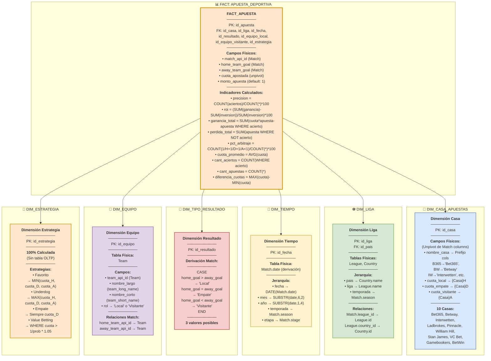

# PASO 2: ANÁLISIS DE LOS OLTP

**Proyecto:** Data Warehouse de Apuestas Deportivas
**Metodología:** HEFESTO
**Fecha:** 2025-10-22
**Arquitecto:** Sistema de Análisis de Datos

## Introducción

Este documento presenta el análisis detallado de la fuente OLTP (base de datos `database.sqlite`) siguiendo el Paso 2 de la metodología HEFESTO. El objetivo es establecer la correspondencia entre el modelo conceptual definido en el Paso 1 y la estructura física de la base de datos fuente.

**Fuente de Datos:** `database.sqlite`
**Tabla Principal:** `Match` (25,979 registros)
**Período:** 2008-2016
**Casas de Apuestas:** 10 (Bet365, Betway, Interwetten, Ladbrokes, Pinnacle, William Hill, Stan James, VC Bet, Gamebookers, BetWin)

---

## 2a) CONFORMAR INDICADORES

En esta sección se definen las fórmulas físicas para calcular cada indicador del modelo conceptual utilizando las tablas y campos reales del OLTP.

### Tabla de Indicadores Conformados

| # | Indicador | Tipo | Fórmula Conceptual | Fórmula Física (SQL) | Tablas Involucradas |
|---|-----------|------|-------------------|---------------------|---------------------|
| 1 | **% Precisión** | No Aditivo | `(Aciertos / Total Apuestas) × 100` | `(COUNT(CASE WHEN prediccion_correcta THEN 1 END) / COUNT(*)) * 100`<br/>donde `prediccion_correcta` se deriva de comparar el resultado real (`home_team_goal` vs `away_team_goal`) con la cuota apostada | `Match` |
| 2 | **ROI %** | No Aditivo | `((Ganancia - Inversión) / Inversión) × 100` | `((SUM(ganancia) - SUM(inversion)) / SUM(inversion)) * 100`<br/>donde:<br/>- `ganancia = CASE WHEN gana THEN cuota * apuesta ELSE 0 END`<br/>- `inversion = apuesta` (constante, ej: 1 unidad)<br/>- `cuota` se obtiene de columnas `{Casa}H/D/A` | `Match` |
| 3 | **Ganancia Total** | Aditivo | `Σ Ganancias` | `SUM(CASE WHEN prediccion_correcta THEN cuota * apuesta - apuesta ELSE 0 END)` | `Match` |
| 4 | **Pérdida Total** | Aditivo | `Σ Pérdidas` | `SUM(CASE WHEN NOT prediccion_correcta THEN apuesta ELSE 0 END)` | `Match` |
| 5 | **% Arbitraje** | No Aditivo | `(Oportunidades Arbitraje / Total Partidos) × 100` | `(COUNT(CASE WHEN (1/cuota_local + 1/cuota_empate + 1/cuota_visitante) < 1 THEN 1 END) / COUNT(*)) * 100`<br/>Nota: Se evalúa para cada casa de apuestas por separado | `Match` |
| 6 | **Cuota Promedio** | Semi-Aditivo | `Promedio de cuotas` | `AVG(cuota)` donde `cuota` es cualquiera de las 30 columnas de cuotas disponibles (10 casas × 3 resultados) | `Match` |
| 7 | **Cant. Aciertos** | Aditivo | `Conteo de predicciones correctas` | `COUNT(CASE WHEN prediccion_correcta THEN 1 END)` | `Match` |
| 8 | **Cant. Apuestas** | Aditivo | `Total de apuestas realizadas` | `COUNT(*)` (contando cada partido como una apuesta potencial) | `Match` |
| 9 | **Diferencia Cuotas** | No Aditivo | `Cuota Máxima - Cuota Mínima` | Para un partido y resultado dado:<br/>`MAX(cuota_resultado) - MIN(cuota_resultado)`<br/>donde se comparan las 10 casas para el mismo tipo de resultado (H, D, o A) | `Match` |

### Notas Importantes sobre Cálculos

#### Derivación de Predicción Correcta
Para determinar si una apuesta fue correcta, se necesita:
1. **Resultado Real:** Derivado de `home_team_goal` vs `away_team_goal`
   - Local gana: `home_team_goal > away_team_goal`
   - Empate: `home_team_goal = away_team_goal`
   - Visitante gana: `home_team_goal < away_team_goal`

2. **Resultado Apostado:** Depende de la estrategia seleccionada (ver dimensión Estrategia)

#### Columnas de Cuotas por Casa de Apuestas
```
Bet365:      B365H, B365D, B365A
Betway:      BWH, BWD, BWA
Interwetten: IWH, IWD, IWA
Ladbrokes:   LBH, LBD, LBA
Pinnacle:    PSH, PSD, PSA
WilliamHill: WHH, WHD, WHA
Stan James:  SJH, SJD, SJA
VC Bet:      VCH, VCD, VCA
Gamebookers: GBH, GBD, GBA
BetWin:      BSH, BSD, BSA
```
Sufijos: H=Home (Local), D=Draw (Empate), A=Away (Visitante)

---

## 2b) ESTABLECER CORRESPONDENCIAS

Esta sección mapea cada perspectiva (dimensión) del modelo conceptual a las tablas físicas del OLTP.

### Tabla de Correspondencias

| Perspectiva (Dimensión) | Tabla(s) OLTP | Relación | Tipo de Mapeo | Observaciones |
|-------------------------|---------------|----------|---------------|---------------|
| **Casa de Apuestas** | `Match` | - | **Derivada** (Unpivot) | No existe como tabla. Se deriva haciendo unpivot de las 30 columnas de cuotas. Cada casa tiene 3 columnas (H/D/A) → se transforma en 10 registros por partido |
| **Liga** | `League`<br/>`Country` | `League.country_id → Country.id`<br/>`Match.league_id → League.id` | **Directa** con jerarquía | Jerarquía: País → Liga → Temporada |
| **Tiempo** | `Match` | - | **Derivada** | Se extrae de `Match.date` (formato texto)<br/>- Fecha: `date`<br/>- Mes: `SUBSTR(date, 6, 2)`<br/>- Año: `SUBSTR(date, 1, 4)`<br/>- Temporada: `season` |
| **Tipo Resultado** | `Match` | - | **Derivada** | Se calcula comparando:<br/>- Local: `home_team_goal > away_team_goal`<br/>- Empate: `home_team_goal = away_team_goal`<br/>- Visitante: `home_team_goal < away_team_goal` |
| **Equipo** | `Team` | `Match.home_team_api_id → Team.team_api_id`<br/>`Match.away_team_api_id → Team.team_api_id` | **Directa** | Se necesitan 2 registros por partido (equipo local y visitante) |
| **Estrategia** | - | - | **Completamente Derivada** | No existe en OLTP. Se calcula según reglas de negocio:<br/>- **Favorito**: apostar a la cuota más baja<br/>- **Underdog**: apostar a la cuota más alta<br/>- **Empate**: siempre apostar al empate<br/>- **Value Betting**: apostar cuando cuota > probabilidad implícita |

### Diagrama de Correspondencias

```
MODELO CONCEPTUAL          →    OLTP (database.sqlite)
═══════════════════              ════════════════════════

FACT: Apuesta Deportiva    →    Match (25,979 rows)
├─ Indicadores             →    [Calculados desde Match.*]
│
DIM: Casa de Apuestas      →    [UNPIVOT de Match columns]
├─ Bet365                  →    B365H, B365D, B365A
├─ Betway                  →    BWH, BWD, BWA
├─ Interwetten             →    IWH, IWD, IWA
├─ Ladbrokes               →    LBH, LBD, LBA
├─ Pinnacle                →    PSH, PSD, PSA
├─ William Hill            →    WHH, WHD, WHA
├─ Stan James              →    SJH, SJD, SJA
├─ VC Bet                  →    VCH, VCD, VCA
├─ Gamebookers             →    GBH, GBD, GBA
└─ BetWin                  →    BSH, BSD, BSA

DIM: Liga                  →    League + Country
├─ Liga.país               →    Country.name
├─ Liga.nombre             →    League.name
└─ Liga.temporada          →    Match.season

DIM: Tiempo                →    Match.date (derivación)
├─ Fecha                   →    Match.date
├─ Mes                     →    SUBSTR(date, 6, 2)
├─ Año                     →    SUBSTR(date, 1, 4)
└─ Temporada               →    Match.season

DIM: Tipo Resultado        →    [Comparación de goles]
├─ Local                   →    home_team_goal > away_team_goal
├─ Empate                  →    home_team_goal = away_team_goal
└─ Visitante               →    home_team_goal < away_team_goal

DIM: Equipo                →    Team
├─ Equipo Local            →    Match.home_team_api_id → Team
└─ Equipo Visitante        →    Match.away_team_api_id → Team

DIM: Estrategia            →    [Lógica de negocio]
├─ Favorito                →    MIN(cuota_local, cuota_empate, cuota_visitante)
├─ Underdog                →    MAX(cuota_local, cuota_empate, cuota_visitante)
├─ Empate                  →    Siempre cuota_empate
└─ Value Betting           →    WHERE cuota > (1 / probabilidad_estimada)
```

### Complejidad del Mapeo

| Tipo | Perspectivas | Descripción |
|------|--------------|-------------|
| **Directa** | Liga, Equipo | Existe tabla física con relación FK directa |
| **Derivada Simple** | Tiempo, Tipo Resultado | Se calcula desde campos existentes en Match |
| **Derivada Compleja** | Casa de Apuestas | Requiere unpivot de 30 columnas → 10 filas |
| **Calculada** | Estrategia | 100% lógica de negocio, no hay datos fuente |

---

## 2c) NIVEL DE GRANULARIDAD

Esta sección define los campos específicos de las tablas OLTP que se utilizarán para poblar cada perspectiva en el Data Warehouse.

### Campos Seleccionados por Perspectiva

#### 1. Casa de Apuestas (Derivada desde Match)

**Granularidad:** Una fila por cada combinación (partido × casa de apuestas)

| Campo DW | Campo(s) OLTP | Transformación | Ejemplo |
|----------|---------------|----------------|---------|
| `id_casa` | - | Generado (1-10) | `1` |
| `nombre_casa` | Prefijo columnas | Mapeo estático | `'Bet365'` (de B365*) |
| `codigo_casa` | Prefijo columnas | Extraído | `'B365'` |
| `cuota_local` | `B365H`, `BWH`, ... | Unpivot columna H | `1.85` |
| `cuota_empate` | `B365D`, `BWD`, ... | Unpivot columna D | `3.40` |
| `cuota_visitante` | `B365A`, `BWA`, ... | Unpivot columna A | `4.20` |

**Mapeo de Casas:**
```sql
CASE
  WHEN casa = 'B365' THEN 'Bet365'
  WHEN casa = 'BW' THEN 'Betway'
  WHEN casa = 'IW' THEN 'Interwetten'
  WHEN casa = 'LB' THEN 'Ladbrokes'
  WHEN casa = 'PS' THEN 'Pinnacle'
  WHEN casa = 'WH' THEN 'William Hill'
  WHEN casa = 'SJ' THEN 'Stan James'
  WHEN casa = 'VC' THEN 'VC Bet'
  WHEN casa = 'GB' THEN 'Gamebookers'
  WHEN casa = 'BS' THEN 'BetWin'
END
```

#### 2. Liga (Directa desde League + Country)

**Granularidad:** Una fila por liga

| Campo DW | Tabla.Campo OLTP | Tipo | Ejemplo |
|----------|------------------|------|---------|
| `id_liga` | `League.id` | INTEGER | `1` |
| `nombre_liga` | `League.name` | TEXT | `'Spain LIGA BBVA'` |
| `id_pais` | `Country.id` | INTEGER | `1` |
| `nombre_pais` | `Country.name` | TEXT | `'Spain'` |
| `temporada` | `Match.season` | TEXT | `'2015/2016'` |

**Jerarquía:** País → Liga → Temporada

#### 3. Tiempo (Derivada desde Match.date)

**Granularidad:** Una fila por fecha única

| Campo DW | Campo OLTP | Transformación SQL | Ejemplo |
|----------|------------|-------------------|---------|
| `fecha` | `Match.date` | `DATE(date)` | `'2016-01-15'` |
| `dia` | `Match.date` | `CAST(SUBSTR(date, 9, 2) AS INTEGER)` | `15` |
| `mes` | `Match.date` | `CAST(SUBSTR(date, 6, 2) AS INTEGER)` | `1` |
| `nombre_mes` | `Match.date` | `CASE mes WHEN 1 THEN 'Enero' ...` | `'Enero'` |
| `año` | `Match.date` | `CAST(SUBSTR(date, 1, 4) AS INTEGER)` | `2016` |
| `temporada` | `Match.season` | Directo | `'2015/2016'` |
| `etapa` | `Match.stage` | Directo | `19` |

#### 4. Tipo Resultado (Derivada desde Match goles)

**Granularidad:** 3 valores fijos (Local, Empate, Visitante)

| Campo DW | Lógica de Derivación | Ejemplo |
|----------|---------------------|---------|
| `id_resultado` | Generado (1, 2, 3) | `1` |
| `tipo_resultado` | `CASE`<br/>`  WHEN home_team_goal > away_team_goal THEN 'Local'`<br/>`  WHEN home_team_goal = away_team_goal THEN 'Empate'`<br/>`  WHEN home_team_goal < away_team_goal THEN 'Visitante'`<br/>`END` | `'Local'` |
| `codigo_resultado` | `'L'`, `'E'`, `'V'` | `'L'` |

#### 5. Equipo (Directa desde Team)

**Granularidad:** Una fila por equipo

| Campo DW | Tabla.Campo OLTP | Tipo | Ejemplo |
|----------|------------------|------|---------|
| `id_equipo` | `Team.id` | INTEGER | `1` |
| `team_api_id` | `Team.team_api_id` | INTEGER | `9987` |
| `nombre_largo` | `Team.team_long_name` | TEXT | `'Real Madrid CF'` |
| `nombre_corto` | `Team.team_short_name` | TEXT | `'REA'` |
| `rol_partido` | - | Derivado | `'Local'` o `'Visitante'` |

**Nota:** Cada partido genera 2 referencias (home_team_api_id y away_team_api_id)

#### 6. Estrategia (Calculada, sin tabla OLTP)

**Granularidad:** 4 estrategias fijas + variantes dinámicas

| Campo DW | Definición | Lógica de Cálculo |
|----------|-----------|-------------------|
| `id_estrategia` | ID único | `1, 2, 3, 4` |
| `nombre_estrategia` | Nombre descriptivo | `'Favorito'`, `'Underdog'`, `'Empate'`, `'Value Betting'` |
| `descripcion` | Regla de apuesta | Ver tabla siguiente |
| `resultado_apostado` | Qué se apuesta (H/D/A) | Calculado dinámicamente por partido |

**Lógica de Estrategias:**

| Estrategia | Regla de Selección | Campos Involucrados |
|------------|-------------------|---------------------|
| **Favorito** | Apostar al resultado con **menor** cuota (mayor probabilidad implícita) | `MIN(cuota_H, cuota_D, cuota_A)` |
| **Underdog** | Apostar al resultado con **mayor** cuota (mayor ganancia potencial) | `MAX(cuota_H, cuota_D, cuota_A)` |
| **Empate** | Siempre apostar al empate | `cuota_D` |
| **Value Betting** | Apostar cuando cuota > probabilidad estimada + margen | `WHERE cuota > (1 / prob_estimada) * 1.05` |

---

## 2d) MODELO CONCEPTUAL AMPLIADO

El modelo conceptual ampliado integra los nombres de los campos físicos y las fórmulas de cálculo en el diagrama original.

### Diagrama Mermaid con Campos Físicos



### Cardinalidad de Transformación OLTP → DW

| Tabla/Concepto OLTP | Registros OLTP | Registros DW | Factor | Razón |
|---------------------|----------------|--------------|--------|-------|
| **Match** | 25,979 | 259,790 | **10x** | Unpivot de 10 casas de apuestas |
| Match (con cuotas) | 22,592 | 225,920 | 10x | Solo partidos con datos de apuestas |
| **League** | ~20 | ~20 | 1x | Mapeo directo |
| **Country** | ~11 | ~11 | 1x | Mapeo directo |
| **Team** | ~300 | ~600 | 2x | Cada equipo aparece como Local y Visitante |
| **Fecha** | ~2,920 | ~2,920 | 1x | Fechas únicas del período 2008-2016 |
| **Casa Apuestas** | - | 10 | N/A | Dimensión maestra (estática) |
| **Tipo Resultado** | - | 3 | N/A | Dimensión maestra (Local, Empate, Visitante) |
| **Estrategia** | - | 4 | N/A | Dimensión maestra (Favorito, Underdog, Empate, Value) |

### Claves de Transformación

#### Unpivot de Casas de Apuestas (Crítico)

**Estructura Original (Match):**
```
match_id | B365H | B365D | B365A | BWH | BWD | BWA | ... (30 columnas)
---------|-------|-------|-------|-----|-----|-----|
   1     | 1.85  | 3.40  | 4.20  | 1.90| 3.30| 4.10| ...
```

**Estructura Transformada (FACT_APUESTA):**
```
id_apuesta | match_id | id_casa | cuota_local | cuota_empate | cuota_visitante
-----------|----------|---------|-------------|--------------|----------------
    1      |    1     |    1    |    1.85     |    3.40      |     4.20
    2      |    1     |    2    |    1.90     |    3.30      |     4.10
    ...    |   ...    |   ...   |    ...      |    ...       |     ...
   10      |    1     |   10    |    ...      |    ...       |     ...
```

**SQL de Transformación:**
```sql
SELECT
    ROW_NUMBER() OVER () AS id_apuesta,
    m.match_api_id,
    c.id_casa,
    CASE c.codigo_casa
        WHEN 'B365' THEN m.B365H
        WHEN 'BW' THEN m.BWH
        -- ... resto de casas
    END AS cuota_local,
    CASE c.codigo_casa
        WHEN 'B365' THEN m.B365D
        WHEN 'BW' THEN m.BWD
        -- ... resto de casas
    END AS cuota_empate,
    CASE c.codigo_casa
        WHEN 'B365' THEN m.B365A
        WHEN 'BW' THEN m.BWA
        -- ... resto de casas
    END AS cuota_visitante,
    m.home_team_goal,
    m.away_team_goal,
    m.league_id,
    m.date,
    m.home_team_api_id,
    m.away_team_api_id
FROM Match m
CROSS JOIN (
    SELECT 1 AS id_casa, 'B365' AS codigo_casa, 'Bet365' AS nombre_casa
    UNION ALL SELECT 2, 'BW', 'Betway'
    UNION ALL SELECT 3, 'IW', 'Interwetten'
    UNION ALL SELECT 4, 'LB', 'Ladbrokes'
    UNION ALL SELECT 5, 'PS', 'Pinnacle'
    UNION ALL SELECT 6, 'WH', 'William Hill'
    UNION ALL SELECT 7, 'SJ', 'Stan James'
    UNION ALL SELECT 8, 'VC', 'VC Bet'
    UNION ALL SELECT 9, 'GB', 'Gamebookers'
    UNION ALL SELECT 10, 'BS', 'BetWin'
) c
WHERE
    -- Filtrar partidos sin datos de cuotas (NULLs)
    (c.codigo_casa = 'B365' AND m.B365H IS NOT NULL)
    OR (c.codigo_casa = 'BW' AND m.BWH IS NOT NULL)
    -- ... validación para todas las casas
;
```

---

## RESUMEN EJECUTIVO

### Complejidad del Mapeo

| Aspecto | Valoración | Observaciones |
|---------|-----------|---------------|
| **Indicadores** | ⚠️ Media-Alta | 9 indicadores requieren cálculos complejos (ventanas, agregaciones condicionales) |
| **Correspondencias** | 🔴 Alta | 4/6 perspectivas son derivadas; Casa de Apuestas requiere unpivot complejo |
| **Granularidad** | ⚠️ Media | Campos bien definidos pero necesitan múltiples transformaciones |
| **Calidad de Datos** | ⚠️ Moderada | 3,387 partidos sin datos de cuotas (13% de 25,979) |

### Decisiones Clave de Arquitectura

1. **Unpivot de Casas de Apuestas:** Transformar estructura columnar (30 cols) a filas (10 casas × 3 resultados)
   - **Impacto:** Factor de explosión 10x en registros (25,979 → ~260,000)
   - **Beneficio:** Permite análisis comparativo entre casas y consultas más simples

2. **Estrategia como Dimensión Calculada:** No existe en OLTP, se deriva completamente
   - **Impacto:** Requiere lógica compleja en ETL para determinar cuál resultado apostar
   - **Beneficio:** Permite análisis de rendimiento por tipo de estrategia

3. **Manejo de NULLs en Cuotas:** 13% de partidos sin datos completos
   - **Decisión:** Filtrar en capa ETL, no cargar al DW
   - **Registros válidos:** 22,592 de 25,979 (87%)

4. **Granularidad de la Tabla de Hechos:** Un registro = Un partido + Una casa + Una estrategia
   - **Fórmula:** `#Partidos × #Casas × #Estrategias = 22,592 × 10 × 4 = 903,680 registros potenciales`
   - **Nota:** Número real dependerá de combinaciones válidas (casas con datos disponibles)

### Siguientes Pasos (Paso 3: Modelo Lógico del DW)

1. Diseñar esquema estrella físico con claves subrogadas
2. Definir tablas de dimensiones con atributos SCD (Slowly Changing Dimensions) si aplica
3. Especificar índices y particionamiento de la tabla de hechos
4. Diseñar proceso ETL para unpivot y cálculo de estrategias
5. Definir agregaciones precalculadas para optimizar consultas frecuentes

---

**Fin del Paso 2: Análisis de los OLTP**
