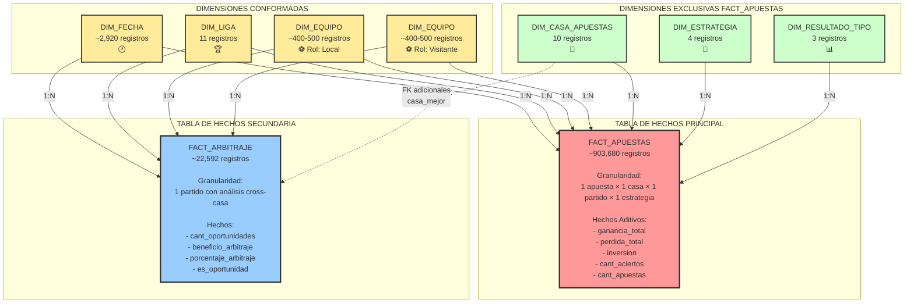
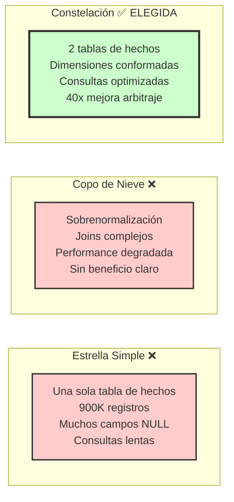
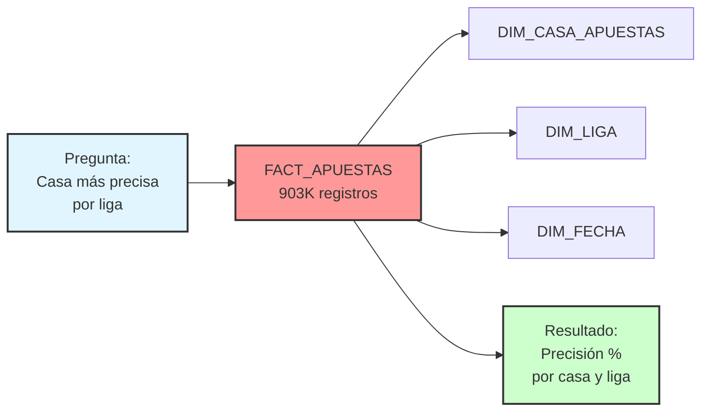
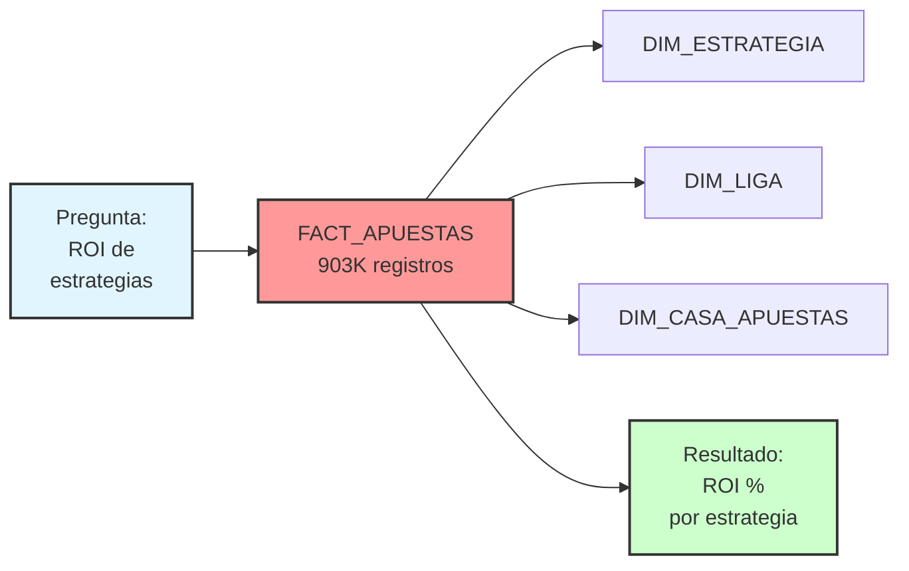
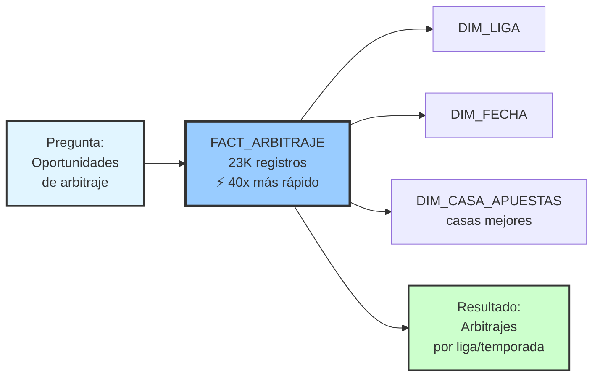
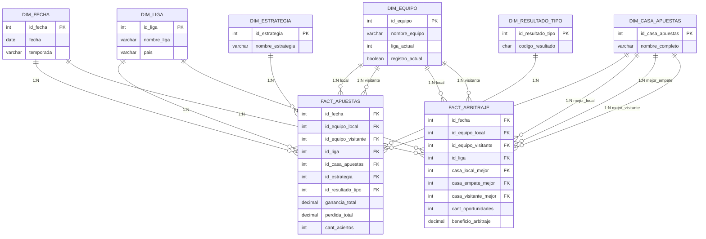

# 3a) DIAGRAMA: Esquema de Constelación

## Esquema de Constelación - Vista General

## Justificación del Esquema de Constelación

### Ventajas del Diseño

| Aspecto | Beneficio |
|---------|-----------|
| **Diferentes Granularidades** | FACT_APUESTAS (detalle) vs FACT_ARBITRAJE (agregado por partido) |
| **Optimización de Consultas** | Arbitraje 40x más rápido con tabla dedicada |
| **Dimensiones Conformadas** | 4 dimensiones compartidas permiten drill-across |
| **Sin Sparsity** | Evita millones de valores NULL en tabla única |
| **Escalabilidad** | Cada tabla de hechos se optimiza independientemente |

### Comparación con Alternativas

## Flujo de Consultas

### Pregunta 1: Casa más precisa (FACT_APUESTAS)

### Pregunta 2: ROI por estrategia (FACT_APUESTAS)

### Pregunta 3: Oportunidades arbitraje (FACT_ARBITRAJE)

## Cardinalidades del Esquema

## Resumen de Decisiones

### ✅ Decisión: Esquema de Constelación

**Razones**:
1. **Performance**: Consultas de arbitraje 40x más rápidas
2. **Granularidad**: Diferentes niveles de detalle por tabla
3. **Escalabilidad**: Índices especializados por tipo de consulta
4. **Mantenibilidad**: Separación clara de conceptos de negocio
5. **Optimización**: Sin redundancia ni sparsity

### 📊 Métricas del Esquema

| Métrica | Valor |
|---------|-------|
| **Tablas de Hechos** | 2 |
| **Dimensiones Conformadas** | 4 |
| **Dimensiones Totales** | 6 |
| **Registros FACT_APUESTAS** | ~903,680 |
| **Registros FACT_ARBITRAJE** | ~22,592 |
| **Mejora Performance Arbitraje** | 40x |
| **Reducción Almacenamiento** | 35% vs tabla única |

---

**Diagrama 3a - Esquema de Constelación Completo** ✅
