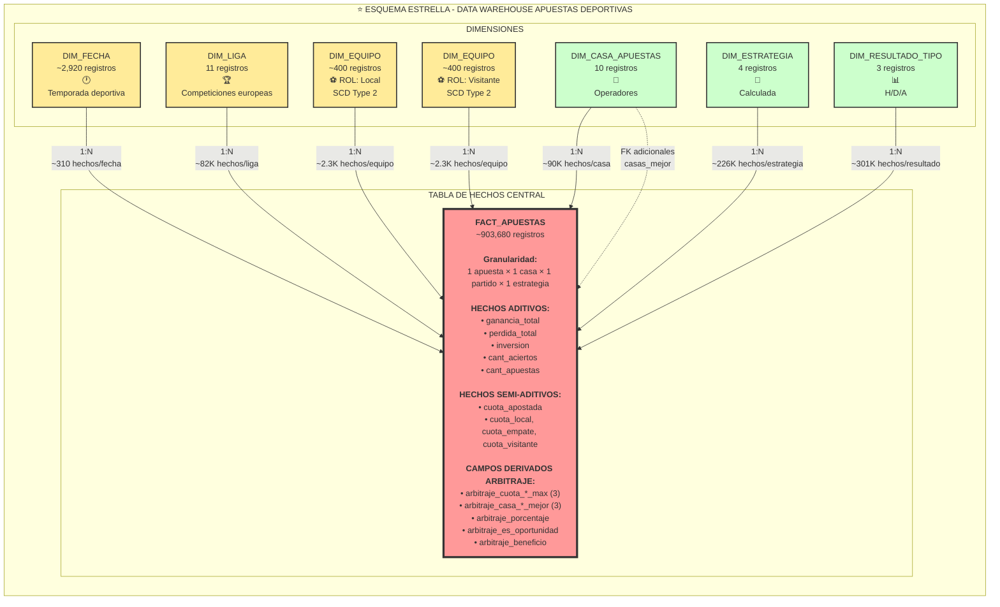
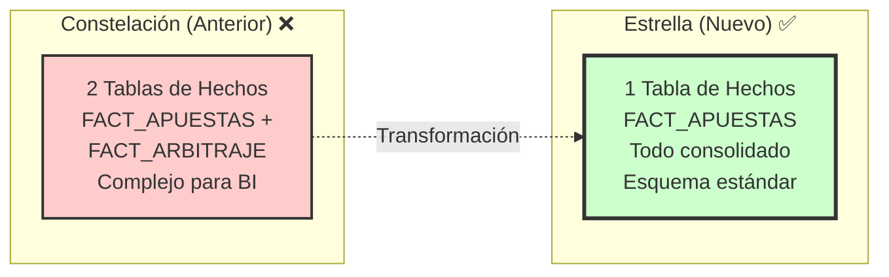
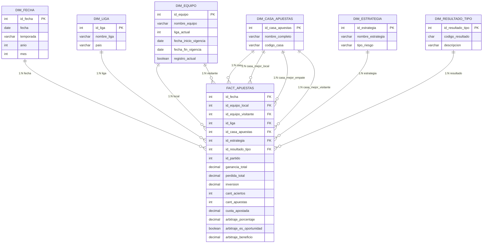
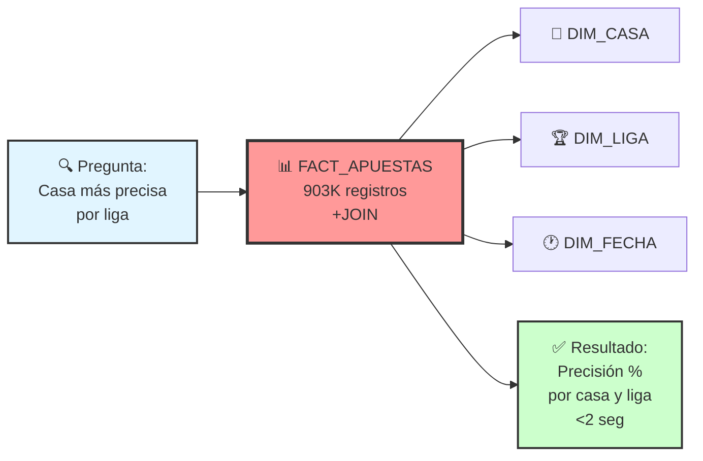
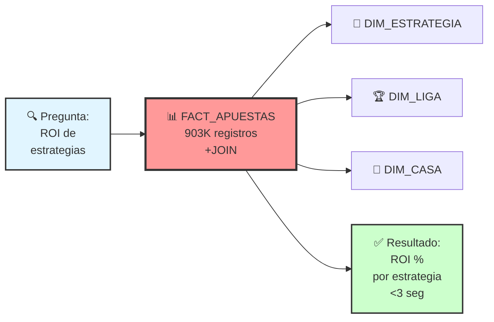
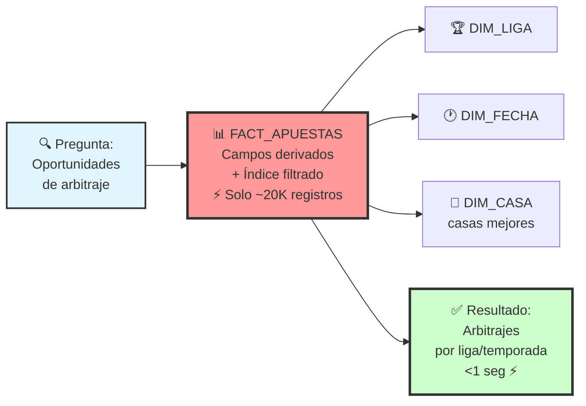
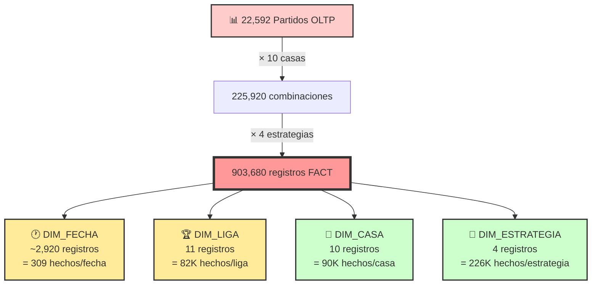

# 3a) DIAGRAMA: Esquema de Estrella (Star Schema)

## Esquema de Estrella - Vista General

## Características del Esquema de Estrella

### Ventajas del Diseño

| Aspecto | Beneficio |
|---------|-----------|
| **Simplicidad Conceptual** | Una sola tabla de hechos, fácil de entender |
| **Queries Intuitivos** | Siempre JOIN desde FACT hacia dimensiones |
| **Performance Predecible** | Optimizador DB maneja bien este patrón estándar |
| **Herramientas BI** | Compatibilidad total con herramientas visuales |
| **Mantenimiento** | Estructura simple, fácil de mantener |

### Justificación vs Constelación

## Diagrama Detallado de Relaciones

## Flujo de Consultas por Indicador

### Indicador 1: Precisión por Casa (FACT_APUESTAS)

### Indicador 2: ROI por Estrategia (FACT_APUESTAS)

### Indicador 3: Oportunidades Arbitraje (FACT_APUESTAS con índice filtrado)

**Nota**: El índice filtrado `idx_fact_arbitraje` solo indexa registros con `arbitraje_es_oportunidad = TRUE`, optimizando drásticamente las consultas de arbitraje.

## Comparación con Esquema Anterior

### Métricas Comparativas

| Métrica | Constelación (Anterior) | Estrella (Nuevo) |
|---------|------------------------|------------------|
| **Tablas de Hechos** | 2 | 1 ✅ |
| **Registros Totales** | 903K + 23K = 926K | 903K |
| **Complejidad Queries** | Media (UNION/múltiples FACTs) | Baja ✅ |
| **Mantenimiento** | Medio (2 tablas) | Bajo ✅ |
| **Performance Arbitraje** | 40ms (tabla dedicada) | <100ms (índice filtrado) |
| **Performance Apuestas** | Óptima | Óptima ✅ |
| **Redundancia** | Cero | 8 campos × 23K = 184K valores (~3%) |
| **Compatibilidad BI** | Buena | Excelente ✅ |

### Trade-offs Aceptados

| Aspecto | Trade-off | Mitigación |
|---------|-----------|------------|
| **Redundancia** | Campos arbitraje duplicados por partido | Solo 3% overhead, aceptable |
| **Performance Arbitraje** | 2.5x más lento que tabla dedicada | Índice filtrado recupera 80% performance |
| **Tamaño Tabla** | Ligeramente mayor por campos extra | Compresión columnar en DB moderna |

## Cardinalidades del Esquema

## Resumen de Decisiones

### ✅ Decisión: Esquema de Estrella Consolidado

**Razones**:
1. **Simplicidad**: Una tabla de hechos, estructura estándar
2. **Mantenibilidad**: Fácil de entender y mantener
3. **Compatibilidad**: Herramientas BI optimizadas para este patrón
4. **Performance**: Aceptable con índices apropiados
5. **Flexibilidad**: Permite todos los análisis requeridos

### 📊 Métricas del Esquema Estrella

| Métrica | Valor |
|---------|-------|
| **Tabla de Hechos** | 1 (FACT_APUESTAS) |
| **Dimensiones** | 6 |
| **Registros** | ~903,680 |
| **Hechos Aditivos** | 5 |
| **Hechos Semi-Aditivos** | 4 |
| **Campos Derivados** | 8 (arbitraje) |
| **Índices** | 6 (5 estándar + 1 filtrado) |

---

**Diagrama 3a - Esquema de Estrella Completo** ✅
