# 3b) DIAGRAMAS: Tablas de Dimensiones

## Vista General de Dimensiones

```mermaid
graph TB
    subgraph "DIMENSIONES CONFORMADAS (Compartidas)"
        DF[DIM_FECHA<br/>~2,920 registros<br/>Temporal]
        DL[DIM_LIGA<br/>11 registros<br/>Geográfica]
        DE[DIM_EQUIPO<br/>~400-500 registros<br/>SCD Tipo 2]
    end

    subgraph "DIMENSIONES EXCLUSIVAS FACT_APUESTAS"
        DCA[DIM_CASA_APUESTAS<br/>10 registros<br/>Descriptiva]
        DES[DIM_ESTRATEGIA<br/>4 registros<br/>Calculada]
        DRT[DIM_RESULTADO_TIPO<br/>3 registros<br/>Estática]
    end

    style DF fill:#ffeb99,stroke:#333,stroke-width:2px
    style DL fill:#ffeb99,stroke:#333,stroke-width:2px
    style DE fill:#ffeb99,stroke:#333,stroke-width:2px
    style DCA fill:#ccffcc,stroke:#333,stroke-width:2px
    style DES fill:#ccffcc,stroke:#333,stroke-width:2px
    style DRT fill:#ccffcc,stroke:#333,stroke-width:2px
```

---

## 1. DIM_CASA_APUESTAS (Dimensión de Casas de Apuestas)

```mermaid
erDiagram
    DIM_CASA_APUESTAS {
        INTEGER id_casa_apuestas PK "Clave subrogada"
        VARCHAR codigo_casa UK "B365, BW, IW, etc."
        VARCHAR nombre_completo "Bet365, Bet&Win"
        VARCHAR pais_origen "UK, Austria"
        DATE fecha_fundacion "2000-01-01"
        VARCHAR tipo_operador "Online, Física"
        BOOLEAN activo "TRUE/FALSE"
    }
```

### Características

| Aspecto | Detalle |
|---------|---------|
| **Tipo** | Dimensión estándar de 1 nivel |
| **Cardinalidad** | 10 registros (fija) |
| **Crecimiento** | Bajo - solo nuevas casas |
| **SCD** | No aplica - datos estáticos |
| **Rol** | Descriptiva y analítica |

### Mapeo desde OLTP

```mermaid
graph LR
    OLTP[Tabla OLTP<br/>30 columnas de cuotas<br/>B365H, B365D, B365A, BWH...] -->|UNPIVOT| DIM[DIM_CASA_APUESTAS<br/>10 registros<br/>1 por casa]

    OLTP -->|Extracción códigos| CODES[Códigos únicos:<br/>B365, BW, IW, PS,<br/>LB, WH, SJ, VC, GB, BS]
    CODES -->|Generación| DIM

    style OLTP fill:#ffcccc,stroke:#333,stroke-width:2px
    style DIM fill:#ccffcc,stroke:#333,stroke-width:2px
```

### Ejemplo de Datos

| id_casa_apuestas | codigo_casa | nombre_completo | pais_origen | tipo_operador |
|------------------|-------------|-----------------|-------------|---------------|
| 1 | B365 | Bet365 | Reino Unido | Online |
| 2 | BW | Bet&Win | Austria | Online |
| 3 | IW | Interwetten | Austria | Online |
| 4 | PS | Pinnacle Sports | Curazao | Online |
| 5 | LB | Ladbrokes | Reino Unido | Híbrido |

---

## 2. DIM_LIGA (Dimensión de Ligas)


### Características

| Aspecto | Detalle |
|---------|---------|
| **Tipo** | Dimensión geográfica |
| **Cardinalidad** | 11 registros (fija) |
| **Jerarquía** | País → Liga |
| **SCD** | No aplica |
| **Rol** | Conformada (compartida) |

### Distribución Geográfica

```mermaid
graph TB
    subgraph "INGLATERRA"
        E0[Premier League<br/>E0 - 20 equipos]
        E1[Championship<br/>E1 - 24 equipos]
        E2[League One<br/>E2 - 24 equipos]
        E3[League Two<br/>E3 - 24 equipos]
    end

    subgraph "ESCOCIA"
        SC0[Scottish Premiership<br/>SC0 - 12 equipos]
        SC1[Scottish Championship<br/>SC1 - 10 equipos]
        SC2[Scottish League One<br/>SC2 - 10 equipos]
        SC3[Scottish League Two<br/>SC3 - 10 equipos]
    end

    subgraph "ESPAÑA"
        SP1[La Liga<br/>SP1 - 20 equipos]
    end

    subgraph "ALEMANIA"
        D1[Bundesliga<br/>D1 - 18 equipos]
    end

    subgraph "OTROS"
        D2[2. Bundesliga<br/>D2 - 18 equipos]
    end

    style E0 fill:#ff9999,stroke:#333,stroke-width:2px
    style SC0 fill:#99ccff,stroke:#333,stroke-width:2px
    style SP1 fill:#ffeb99,stroke:#333,stroke-width:2px
    style D1 fill:#ccffcc,stroke:#333,stroke-width:2px
```

### Ejemplo de Datos

| id_liga | nombre_liga | pais | nivel | num_equipos | codigo_uefa |
|---------|-------------|------|-------|-------------|-------------|
| 1 | Premier League | England | Primera | 20 | ENG1 |
| 2 | La Liga | Spain | Primera | 20 | ESP1 |
| 3 | Bundesliga | Germany | Primera | 18 | GER1 |
| 4 | Scottish Premiership | Scotland | Primera | 12 | SCO1 |
| 5 | Championship | England | Segunda | 24 | ENG2 |

---

## 3. DIM_FECHA (Dimensión de Tiempo)

```mermaid
erDiagram
    DIM_FECHA {
        INTEGER id_fecha PK "YYYYMMDD: 20080815"
        DATE fecha UK "2008-08-15"
        VARCHAR temporada "2008-2009"
        INTEGER año "2008"
        INTEGER mes "8"
        VARCHAR mes_nombre "Agosto"
        INTEGER dia "15"
        VARCHAR dia_semana "Viernes"
        INTEGER num_dia_semana "5"
        INTEGER trimestre "3"
        VARCHAR periodo "Inicio temporada"
        BOOLEAN es_fin_semana "TRUE/FALSE"
    }
```

### Características

| Aspecto | Detalle |
|---------|---------|
| **Tipo** | Dimensión temporal estándar |
| **Cardinalidad** | ~2,920 registros |
| **Rango** | 2008-08-15 a 2016-05-31 |
| **Granularidad** | Día |
| **Rol** | Conformada (compartida) |

### Jerarquía Temporal

```mermaid
graph TB
    T[Temporada<br/>2008-2009 a 2015-2016<br/>8 temporadas] --> A[Año<br/>2008 a 2016<br/>9 años]
    A --> TR[Trimestre<br/>Q1, Q2, Q3, Q4]
    TR --> M[Mes<br/>1-12]
    M --> D[Día<br/>Fecha específica]

    D --> DS[Atributos:<br/>- Día semana<br/>- Fin semana<br/>- Periodo temporada]

    style T fill:#ff9999,stroke:#333,stroke-width:3px
    style A fill:#ffcc99,stroke:#333,stroke-width:2px
    style TR fill:#ffeb99,stroke:#333,stroke-width:2px
    style M fill:#ffffcc,stroke:#333,stroke-width:2px
    style D fill:#ccffcc,stroke:#333,stroke-width:2px
```

### Distribución por Temporada

```mermaid
pie title "Distribución de Partidos por Temporada"
    "2008-09" : 2056
    "2009-10" : 2840
    "2010-11" : 2840
    "2011-12" : 2840
    "2012-13" : 2840
    "2013-14" : 2840
    "2014-15" : 2840
    "2015-16" : 2496
```

### Ejemplo de Datos

| id_fecha | fecha | temporada | año | mes | dia_semana | es_fin_semana | periodo |
|----------|-------|-----------|-----|-----|------------|---------------|---------|
| 20080815 | 2008-08-15 | 2008-2009 | 2008 | 8 | Viernes | TRUE | Inicio |
| 20081025 | 2008-10-25 | 2008-2009 | 2008 | 10 | Sábado | TRUE | Medio |
| 20090516 | 2009-05-16 | 2008-2009 | 2009 | 5 | Sábado | TRUE | Final |

---

## 4. DIM_RESULTADO_TIPO (Dimensión de Tipos de Resultado)


### Características

| Aspecto | Detalle |
|---------|---------|
| **Tipo** | Dimensión estática pequeña |
| **Cardinalidad** | 3 registros (fija) |
| **Crecimiento** | Nulo - dimensión cerrada |
| **SCD** | No aplica |
| **Rol** | Descriptiva |

### Tipos de Resultado

```mermaid
graph LR
    subgraph "3 RESULTADOS POSIBLES"
        H[H - Home Win<br/>Victoria Local<br/>🏠]
        D[D - Draw<br/>Empate<br/>⚖️]
        A[A - Away Win<br/>Victoria Visitante<br/>✈️]
    end

    H -->|Probabilidad| PH[P = 1/cuota_local]
    D -->|Probabilidad| PD[P = 1/cuota_empate]
    A -->|Probabilidad| PA[P = 1/cuota_visitante]

    style H fill:#ff9999,stroke:#333,stroke-width:2px
    style D fill:#ffeb99,stroke:#333,stroke-width:2px
    style A fill:#99ccff,stroke:#333,stroke-width:2px
```

### Ejemplo de Datos

| id_resultado_tipo | codigo_resultado | descripcion | descripcion_larga | orden_display |
|-------------------|------------------|-------------|-------------------|---------------|
| 1 | H | Victoria Local | El equipo local gana el partido | 1 |
| 2 | D | Empate | El partido termina en empate | 2 |
| 3 | A | Victoria Visitante | El equipo visitante gana el partido | 3 |

---

## 5. DIM_EQUIPO (Dimensión de Equipos con SCD Tipo 2)


### Características SCD Tipo 2

| Aspecto | Detalle |
|---------|---------|
| **Tipo** | SCD Tipo 2 - Histórico completo |
| **Cardinalidad** | ~400-500 registros (versiones) |
| **Equipos únicos** | ~300 equipos |
| **Versiones promedio** | 1.3-1.7 por equipo |
| **Trigger cambio** | Cambio de liga (ascenso/descenso) |
| **Rol** | Conformada + Role-playing |

### Versionado Temporal

```mermaid
graph TB
    subgraph "EJEMPLO: Leicester City"
        V1[Versión 1<br/>id_equipo: 245<br/>liga: Championship E1<br/>2008-08-15 → 2014-05-31<br/>registro_actual: FALSE]

        V2[Versión 2<br/>id_equipo: 246<br/>liga: Premier League E0<br/>2014-06-01 → NULL<br/>registro_actual: TRUE]

        V1 -->|Ascenso<br/>2014| V2
    end

    style V1 fill:#ffcccc,stroke:#333,stroke-width:2px
    style V2 fill:#ccffcc,stroke:#333,stroke-width:2px
```

### Role-Playing: Local y Visitante


### Ejemplo de Datos con Versiones

| id_equipo | codigo_natural | nombre_equipo | liga_actual | fecha_inicio | fecha_fin | registro_actual | version |
|-----------|----------------|---------------|-------------|--------------|-----------|-----------------|---------|
| 245 | LEICESTER | Leicester City | 2 (E1) | 2008-08-15 | 2014-05-31 | FALSE | 1 |
| 246 | LEICESTER | Leicester City | 1 (E0) | 2014-06-01 | NULL | TRUE | 2 |
| 112 | MAN_UTD | Manchester United | 1 (E0) | 2008-08-15 | NULL | TRUE | 1 |
| 78 | BURNLEY | Burnley FC | 2 (E1) | 2008-08-15 | 2009-05-31 | FALSE | 1 |
| 79 | BURNLEY | Burnley FC | 1 (E0) | 2009-06-01 | 2010-05-31 | FALSE | 2 |
| 80 | BURNLEY | Burnley FC | 2 (E1) | 2010-06-01 | NULL | TRUE | 3 |

---

## 6. DIM_ESTRATEGIA (Dimensión de Estrategias de Apuesta)

```mermaid
erDiagram
    DIM_ESTRATEGIA {
        INTEGER id_estrategia PK "Clave subrogada"
        VARCHAR codigo_estrategia UK "ALWAYS_H, FOLLOW_FAV"
        VARCHAR nombre_estrategia "Siempre Apostar Local"
        VARCHAR descripcion "Apostar al equipo local"
        VARCHAR tipo_estrategia "Fija, Probabilística"
        VARCHAR formula_aplicacion "Apostar H siempre"
    }
```

### Características

| Aspecto | Detalle |
|---------|---------|
| **Tipo** | Dimensión calculada/analítica |
| **Cardinalidad** | 4 registros (fija) |
| **Generación** | Durante ETL (multiplicador) |
| **SCD** | No aplica |
| **Rol** | Analítica para simulación |

### Las 4 Estrategias

```mermaid
graph TB
    subgraph "ESTRATEGIAS DE APUESTA"
        E1[1. ALWAYS_H<br/>Siempre Local<br/>🏠<br/>Apostar H en todos los partidos]

        E2[2. ALWAYS_A<br/>Siempre Visitante<br/>✈️<br/>Apostar A en todos los partidos]

        E3[3. FOLLOW_FAV<br/>Seguir Favorito<br/>⭐<br/>Apostar al resultado con menor cuota]

        E4[4. UNDERDOG<br/>Apostar Underdog<br/>🐕<br/>Apostar al resultado con mayor cuota]
    end

    style E1 fill:#ff9999,stroke:#333,stroke-width:2px
    style E2 fill:#99ccff,stroke:#333,stroke-width:2px
    style E3 fill:#ffeb99,stroke:#333,stroke-width:2px
    style E4 fill:#ccffcc,stroke:#333,stroke-width:2px
```

### Multiplicación en ETL

```mermaid
graph LR
    OLTP[1 Partido OLTP<br/>10 casas<br/>= 10 registros base] -->|Multiplicar × 4| ETL[ETL Process<br/>Generar estrategias]

    ETL --> S1[10 reg × ALWAYS_H]
    ETL --> S2[10 reg × ALWAYS_A]
    ETL --> S3[10 reg × FOLLOW_FAV]
    ETL --> S4[10 reg × UNDERDOG]

    S1 --> DW[40 registros en FACT_APUESTAS<br/>por partido]
    S2 --> DW
    S3 --> DW
    S4 --> DW

    style OLTP fill:#ffcccc,stroke:#333,stroke-width:2px
    style ETL fill:#ffffcc,stroke:#333,stroke-width:2px
    style DW fill:#ccffcc,stroke:#333,stroke-width:2px
```

### Ejemplo de Datos

| id_estrategia | codigo_estrategia | nombre_estrategia | tipo_estrategia | formula_aplicacion |
|---------------|-------------------|-------------------|-----------------|-------------------|
| 1 | ALWAYS_H | Siempre Apostar Local | Fija | Apostar H siempre |
| 2 | ALWAYS_A | Siempre Apostar Visitante | Fija | Apostar A siempre |
| 3 | FOLLOW_FAV | Seguir al Favorito | Probabilística | Apostar MIN(cuotas) |
| 4 | UNDERDOG | Apostar al Underdog | Probabilística | Apostar MAX(cuotas) |

---

## Resumen de Dimensiones

```mermaid
graph TB
    subgraph "CLASIFICACIÓN POR TIPO"
        T1[Temporal: DIM_FECHA<br/>~2,920 registros]
        T2[Geográfica: DIM_LIGA<br/>11 registros]
        T3[Descriptiva: DIM_CASA_APUESTAS<br/>10 registros]
        T4[Histórica SCD2: DIM_EQUIPO<br/>~400 registros]
        T5[Estática: DIM_RESULTADO_TIPO<br/>3 registros]
        T6[Calculada: DIM_ESTRATEGIA<br/>4 registros]
    end

    subgraph "CLASIFICACIÓN POR ROL"
        R1[Conformadas:<br/>DIM_FECHA<br/>DIM_LIGA<br/>DIM_EQUIPO]

        R2[Exclusivas FACT_APUESTAS:<br/>DIM_CASA_APUESTAS<br/>DIM_ESTRATEGIA<br/>DIM_RESULTADO_TIPO]
    end

    style T1 fill:#ffeb99,stroke:#333,stroke-width:2px
    style T2 fill:#ffeb99,stroke:#333,stroke-width:2px
    style T3 fill:#ccffcc,stroke:#333,stroke-width:2px
    style T4 fill:#ffeb99,stroke:#333,stroke-width:2px
    style T5 fill:#ccffcc,stroke:#333,stroke-width:2px
    style T6 fill:#ccffcc,stroke:#333,stroke-width:2px
```

### Tabla Comparativa

| Dimensión | Cardinalidad | Tipo | SCD | Conformada | Crecimiento |
|-----------|--------------|------|-----|------------|-------------|
| DIM_FECHA | ~2,920 | Temporal | No | Sí | Bajo |
| DIM_LIGA | 11 | Geográfica | No | Sí | Nulo |
| DIM_EQUIPO | ~400 | Descriptiva | SCD-2 | Sí | Medio |
| DIM_CASA_APUESTAS | 10 | Descriptiva | No | No | Bajo |
| DIM_ESTRATEGIA | 4 | Calculada | No | No | Nulo |
| DIM_RESULTADO_TIPO | 3 | Estática | No | No | Nulo |

---

**Diagrama 3b - Tablas de Dimensiones Completo** ✅
