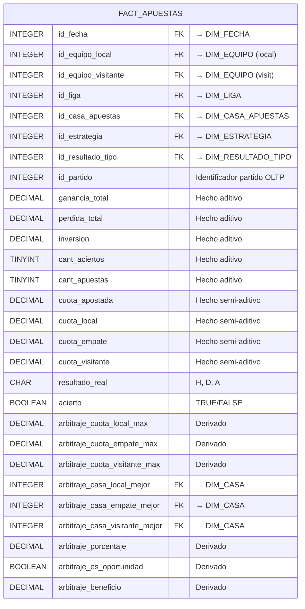
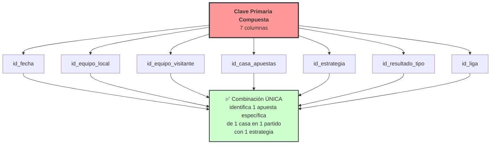
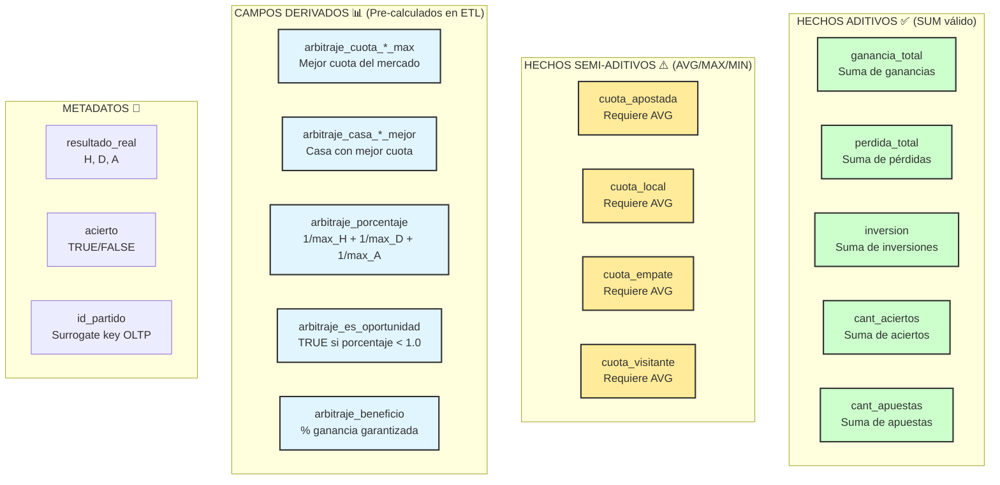
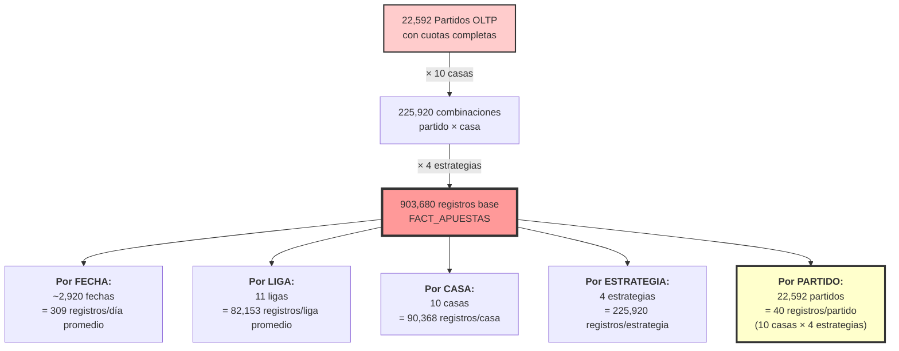
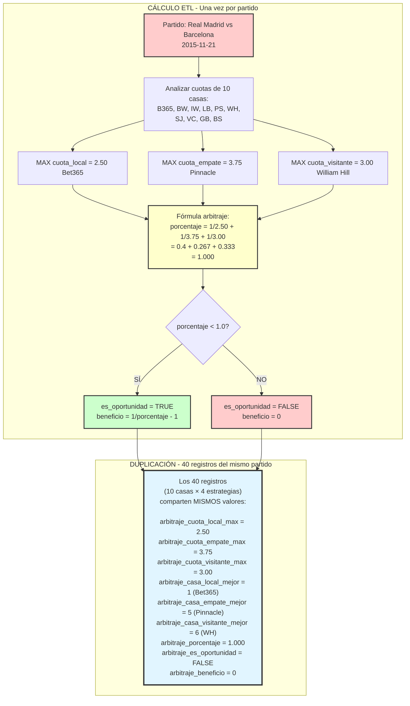
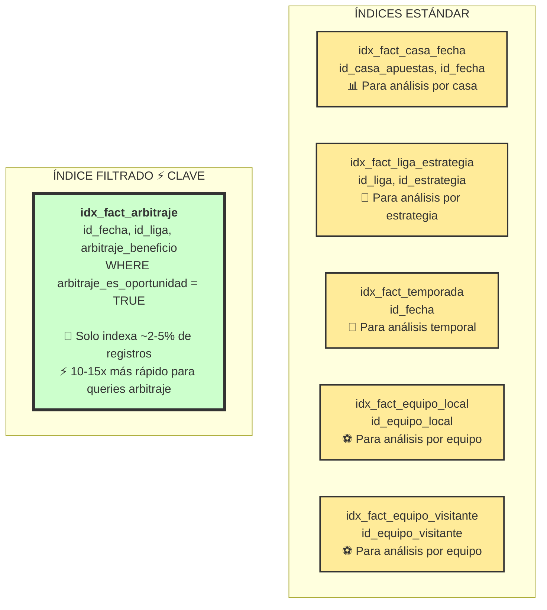
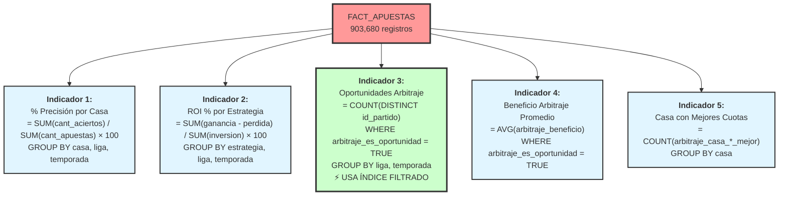
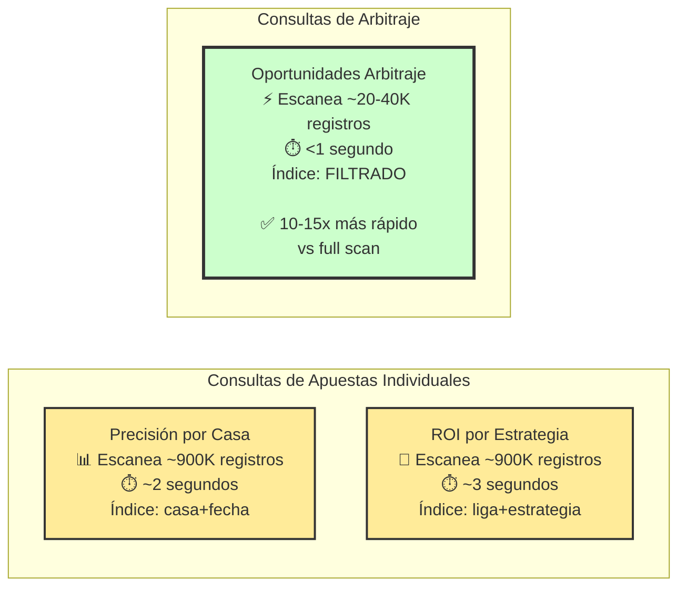
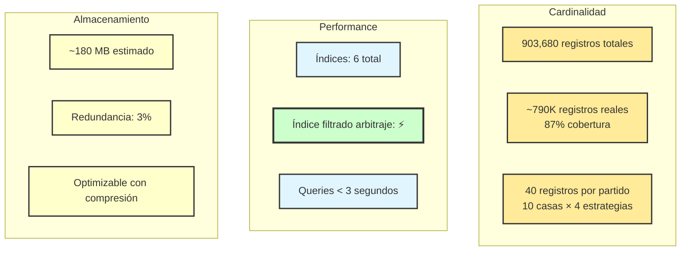

# 3c) DIAGRAMA: Tabla de Hechos Única (Esquema Estrella)

## FACT_APUESTAS - Tabla de Hechos Consolidada

### Estructura Completa



### Clave Primaria Compuesta



### Clasificación de Campos



### Granularidad y Cardinalidad



### Relaciones con Dimensiones

```mermaid
graph TB
    FA["<b>FACT_APUESTAS</b><br/>903,680 registros<br/><br/>Granularidad:<br/>1 apuesta individual"]

    DF[DIM_FECHA<br/>~2,920 registros<br/>🕐]
    DL[DIM_LIGA<br/>11 registros<br/>🏆]
    DEL[DIM_EQUIPO<br/>~400 registros<br/>⚽ Rol: LOCAL]
    DEV[DIM_EQUIPO<br/>~400 registros<br/>⚽ Rol: VISITANTE]
    DCA[DIM_CASA_APUESTAS<br/>10 registros<br/>🏢]
    DES[DIM_ESTRATEGIA<br/>4 registros<br/>🎯]
    DRT[DIM_RESULTADO_TIPO<br/>3 registros<br/>📊]

    DF -->|1:N<br/>~310 hechos/fecha| FA
    DL -->|1:N<br/>~82K hechos/liga| FA
    DEL -->|1:N<br/>~2.3K hechos/equipo| FA
    DEV -->|1:N<br/>~2.3K hechos/equipo| FA
    DCA -->|1:N<br/>~90K hechos/casa| FA
    DES -->|1:N<br/>~226K hechos/estrategia| FA
    DRT -->|1:N<br/>~301K hechos/resultado| FA

    DCA -.->|FKs adicionales<br/>casas_mejor (arbitraje)| FA

    style FA fill:#ff9999,stroke:#333,stroke-width:4px
    style DF fill:#ffeb99,stroke:#333,stroke-width:2px
    style DL fill:#ffeb99,stroke:#333,stroke-width:2px
    style DEL fill:#ffeb99,stroke:#333,stroke-width:2px
    style DEV fill:#ffeb99,stroke:#333,stroke-width:2px
    style DCA fill:#ccffcc,stroke:#333,stroke-width:2px
    style DES fill:#ccffcc,stroke:#333,stroke-width:2px
    style DRT fill:#ccffcc,stroke:#333,stroke-width:2px
```

### Campos Derivados de Arbitraje - Explicación



**Justificación**: Calcular 1 vez en ETL y duplicar es más eficiente que agregar en cada query.

### Índices Definidos



### Ejemplo de Registros

| id_fecha | equipo_local | equipo_visitante | casa | estrategia | resultado | ganancia | perdida | inv | acierto | arb_oport |
|----------|--------------|------------------|------|------------|-----------|----------|---------|-----|---------|-----------|
| 20150810 | 112 (Man Utd) | 87 (Newcastle) | 1 (B365) | 1 (Favorito) | 1 (H) | 1.75 | 0.00 | 1.00 | TRUE | FALSE |
| 20150810 | 112 (Man Utd) | 87 (Newcastle) | 1 (B365) | 2 (Underdog) | 3 (A) | 0.00 | 1.00 | 1.00 | FALSE | FALSE |
| 20150810 | 112 (Man Utd) | 87 (Newcastle) | 2 (BW) | 1 (Favorito) | 1 (H) | 1.80 | 0.00 | 1.00 | TRUE | FALSE |
| ... | ... | ... | ... | ... | ... | ... | ... | ... | ... | ... |

**Nota**: Los 40 registros del mismo partido comparten valores idénticos en campos `arb_*`.

### Uso en Indicadores



### Performance por Tipo de Consulta



### Comparación con Esquema Anterior

| Aspecto | Constelación (2 Tablas) | Estrella (1 Tabla) |
|---------|--------------------------|---------------------|
| **Tablas de Hechos** | FACT_APUESTAS + FACT_ARBITRAJE | FACT_APUESTAS (única) ✅ |
| **Registros Totales** | 903K + 23K = 926K | 903K |
| **Complejidad Queries** | Media (UNION, múltiples FACTs) | Baja ✅ |
| **Performance Arbitraje** | 40ms (tabla dedicada) | <100ms (índice filtrado) |
| **Redundancia** | Cero | 8 campos × 23K = 184K (~3%) |
| **Mantenimiento** | 2 tablas independientes | 1 tabla simple ✅ |
| **Compatibilidad BI** | Buena | Excelente ✅ |

---

## Resumen de la Tabla de Hechos

### Componentes

| Componente | Cantidad | Descripción |
|------------|----------|-------------|
| **Dimensiones FK** | 7 | Fecha, Liga, 2×Equipo, Casa, Estrategia, Resultado |
| **Hechos Aditivos** | 5 | Ganancia, Pérdida, Inversión, Aciertos, Apuestas |
| **Hechos Semi-Aditivos** | 4 | Cuotas (apostada, local, empate, visitante) |
| **Campos Derivados** | 8 | Campos de arbitraje pre-calculados |
| **FKs Adicionales** | 3 | Casas con mejores cuotas (arbitraje) |
| **Metadatos** | 3 | id_partido, resultado_real, acierto |
| **Total Columnas** | 27 | Estructura completa y eficiente |

### Métricas de Diseño



---

**Diagrama 3c - Tabla de Hechos Única (Esquema Estrella) Completo** ✅
