# 3c) DIAGRAMAS: Tablas de Hechos

## Vista General de Tablas de Hechos

```mermaid
graph TB
    subgraph "FACT_APUESTAS - Detalle de Apuestas"
        FA[FACT_APUESTAS<br/>~903,680 registros<br/><br/>Granularidad:<br/>1 partido × 1 casa × 1 estrategia × 1 resultado<br/><br/>Métricas:<br/>- ganancia_total<br/>- perdida_total<br/>- inversion<br/>- cant_aciertos<br/>- cant_apuestas]
    end

    subgraph "FACT_ARBITRAJE - Análisis Agregado"
        FAR[FACT_ARBITRAJE<br/>~22,592 registros<br/><br/>Granularidad:<br/>1 partido completo<br/>(análisis cross-casa)<br/><br/>Métricas:<br/>- cant_oportunidades<br/>- beneficio_arbitraje<br/>- porcentaje_arbitraje<br/>- es_oportunidad]
    end

    FA -.->|Agregación| FAR

    style FA fill:#ff9999,stroke:#333,stroke-width:3px
    style FAR fill:#99ccff,stroke:#333,stroke-width:3px
```

### Comparación de Tablas

| Aspecto | FACT_APUESTAS | FACT_ARBITRAJE |
|---------|---------------|----------------|
| **Registros** | ~903,680 | ~22,592 |
| **Granularidad** | Apuesta individual | Partido completo |
| **Dimensiones FK** | 7 dimensiones | 4 dimensiones + 3 casas |
| **Métricas** | 12 campos | 9 campos |
| **Propósito** | Análisis detallado apuestas | Detección oportunidades |
| **Performance** | Consultas específicas | 40x más rápido |

---

## 1. FACT_APUESTAS - Tabla de Hechos de Apuestas Detalladas

### Estructura Completa

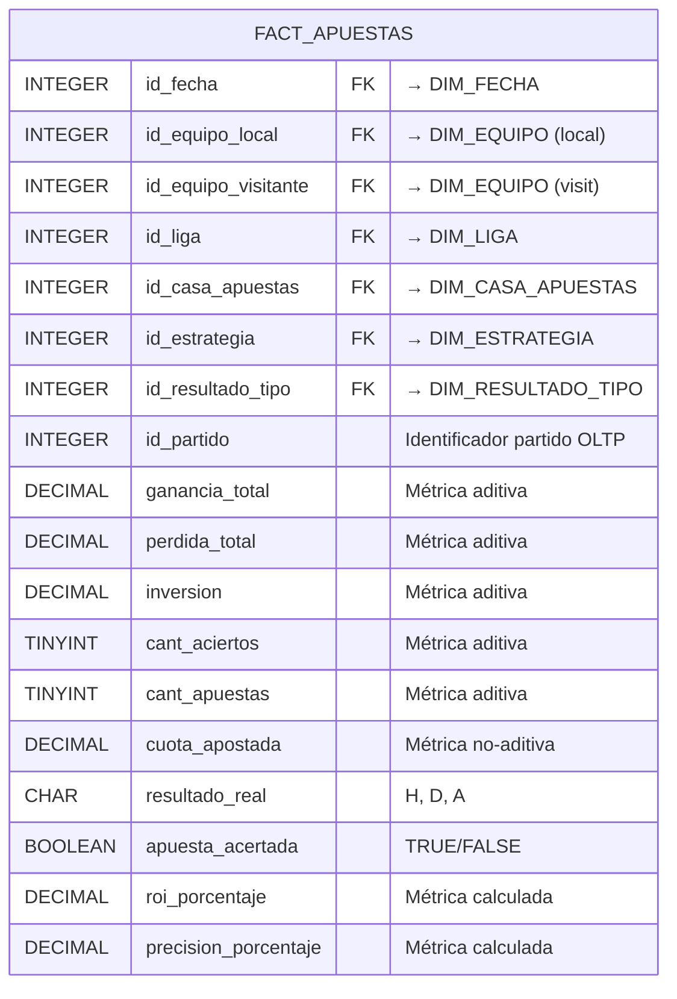

### Clave Primaria Compuesta

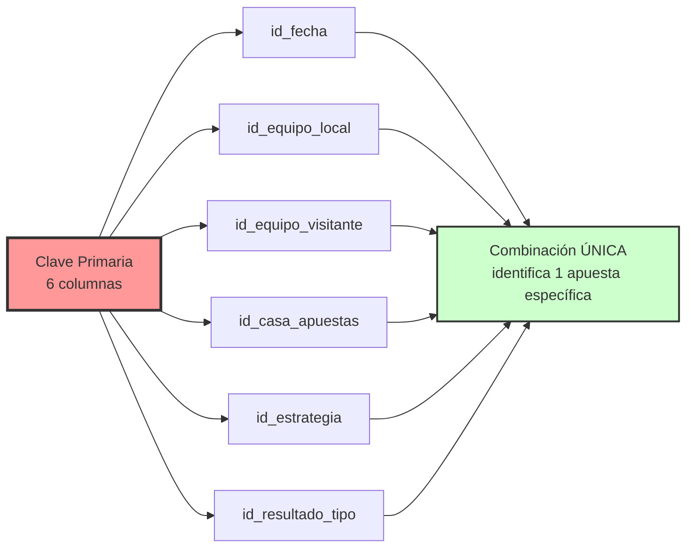

### Clasificación de Métricas

```mermaid
graph TB
    subgraph "MÉTRICAS ADITIVAS ✅"
        A1[ganancia_total<br/>SUM() válido en todas dimensiones]
        A2[perdida_total<br/>SUM() válido en todas dimensiones]
        A3[inversion<br/>SUM() válido en todas dimensiones]
        A4[cant_aciertos<br/>SUM() válido en todas dimensiones]
        A5[cant_apuestas<br/>SUM() válido en todas dimensiones]
    end

    subgraph "MÉTRICAS NO-ADITIVAS ⚠️"
        NA1[cuota_apostada<br/>Requiere AVG() o ponderación]
        NA2[roi_porcentaje<br/>Requiere cálculo derivado]
        NA3[precision_porcentaje<br/>Requiere cálculo derivado]
    end

    A1 & A2 & A3 & A4 & A5 --> SUM[Se pueden sumar<br/>directamente]
    NA1 & NA2 & NA3 --> CALC[Requieren<br/>cálculo especial]

    style A1 fill:#ccffcc,stroke:#333,stroke-width:2px
    style A2 fill:#ccffcc,stroke:#333,stroke-width:2px
    style A3 fill:#ccffcc,stroke:#333,stroke-width:2px
    style A4 fill:#ccffcc,stroke:#333,stroke-width:2px
    style A5 fill:#ccffcc,stroke:#333,stroke-width:2px
    style NA1 fill:#ffeb99,stroke:#333,stroke-width:2px
    style NA2 fill:#ffeb99,stroke:#333,stroke-width:2px
    style NA3 fill:#ffeb99,stroke:#333,stroke-width:2px
```

### Granularidad y Cardinalidad

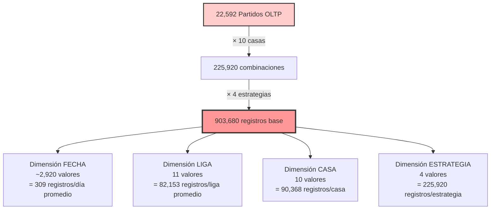

### Relaciones con Dimensiones

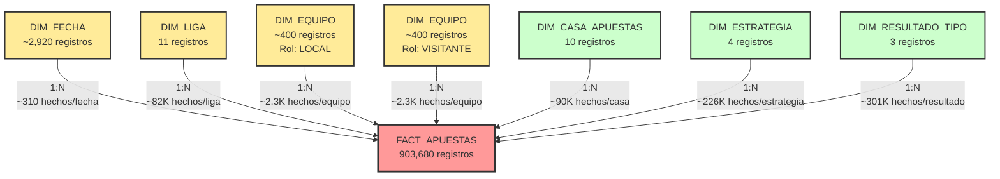

### Ejemplo de Registros

| id_fecha | id_equipo_local | id_equipo_visitante | id_casa | id_estrategia | id_resultado | ganancia | perdida | inversion | acertada |
|----------|-----------------|---------------------|---------|---------------|--------------|----------|---------|-----------|----------|
| 20080815 | 112 (Man Utd) | 87 (Newcastle) | 1 (B365) | 1 (ALWAYS_H) | 1 (H) | 1.75 | 0.00 | 1.00 | TRUE |
| 20080815 | 112 (Man Utd) | 87 (Newcastle) | 1 (B365) | 2 (ALWAYS_A) | 3 (A) | 0.00 | 1.00 | 1.00 | FALSE |
| 20080815 | 112 (Man Utd) | 87 (Newcastle) | 2 (BW) | 3 (FOLLOW_FAV) | 1 (H) | 1.80 | 0.00 | 1.00 | TRUE |

### Uso en Indicadores

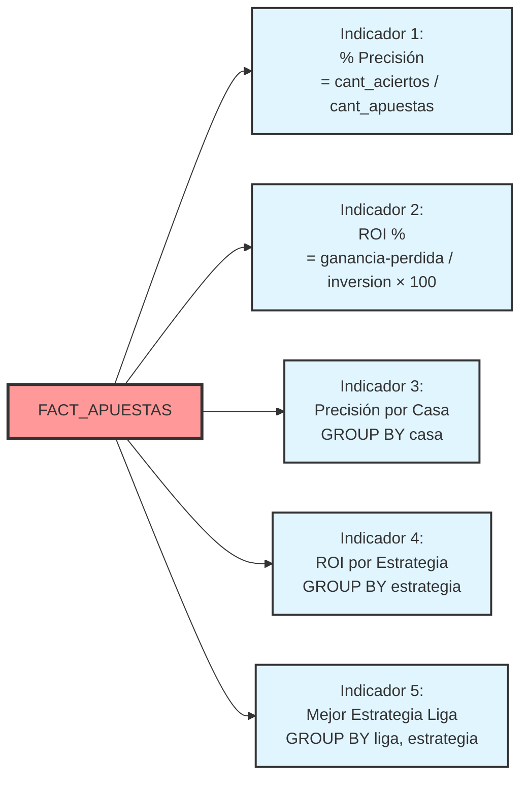

---

## 2. FACT_ARBITRAJE - Tabla de Hechos de Oportunidades de Arbitraje

### Estructura Completa

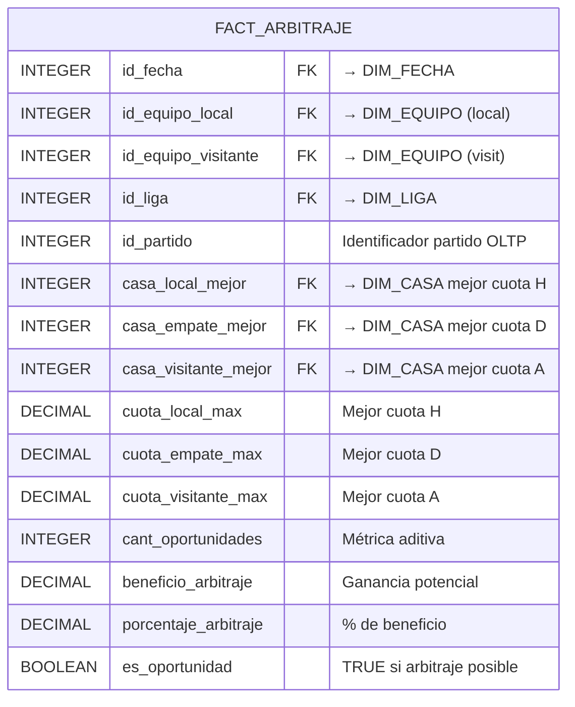

### Clave Primaria Compuesta

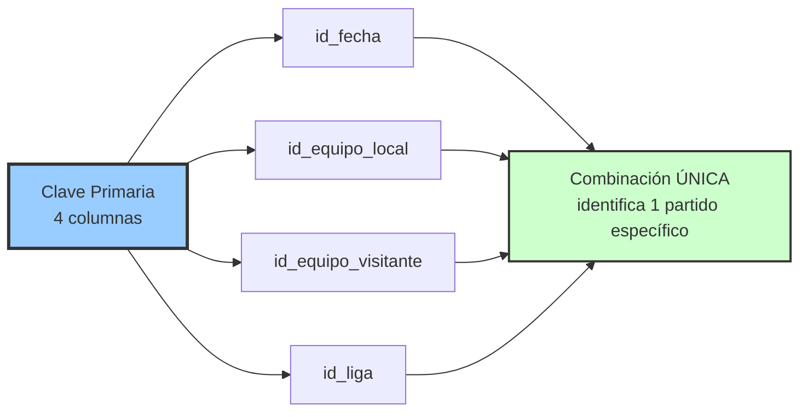

### Lógica de Arbitraje

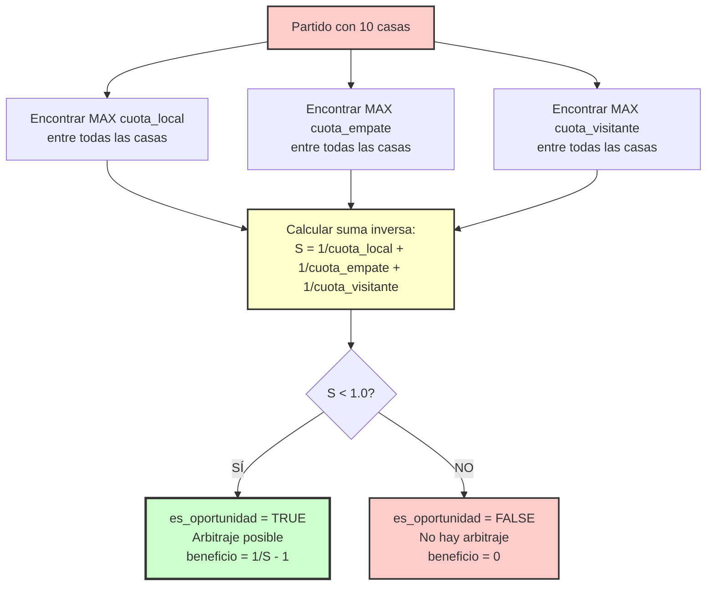

### Cardinalidad Reducida

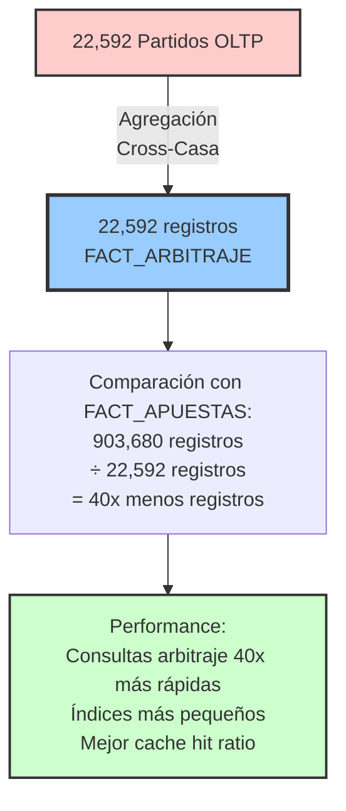

### Relaciones con Dimensiones

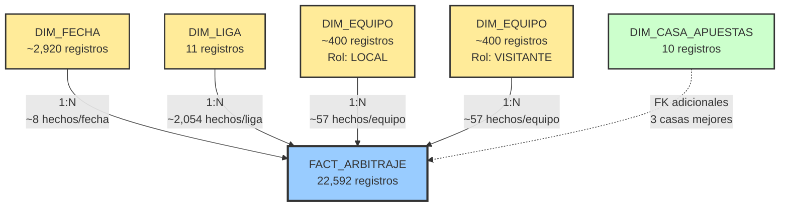

### Ejemplo de Registros

| id_fecha | id_equipo_local | id_equipo_visitante | casa_H_mejor | casa_D_mejor | casa_A_mejor | cuota_H | cuota_D | cuota_A | es_oportunidad | beneficio |
|----------|-----------------|---------------------|--------------|--------------|--------------|---------|---------|---------|----------------|-----------|
| 20080815 | 112 (Man Utd) | 87 (Newcastle) | 4 (PS) | 2 (BW) | 1 (B365) | 1.85 | 3.75 | 5.50 | FALSE | 0.00 |
| 20081025 | 45 (Arsenal) | 78 (Tottenham) | 1 (B365) | 3 (IW) | 4 (PS) | 2.10 | 3.40 | 4.20 | TRUE | 2.35% |

### Uso en Indicadores

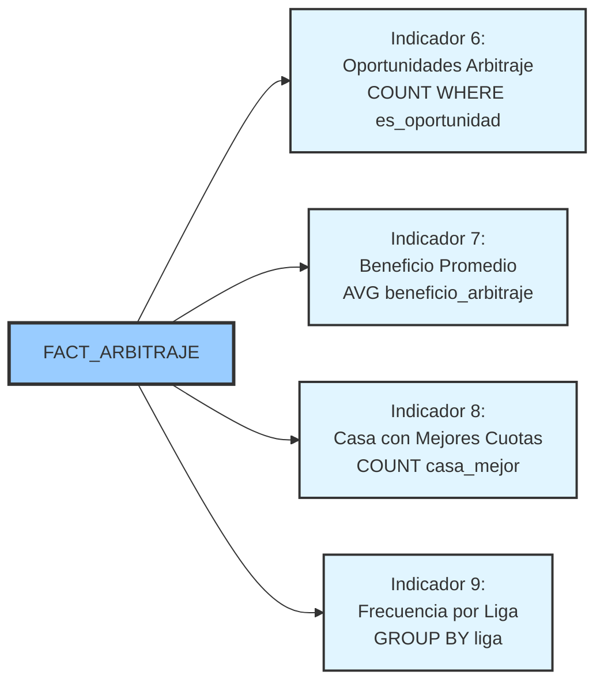

---

## Comparación Detallada de Tablas de Hechos

### Dimensiones Relacionadas

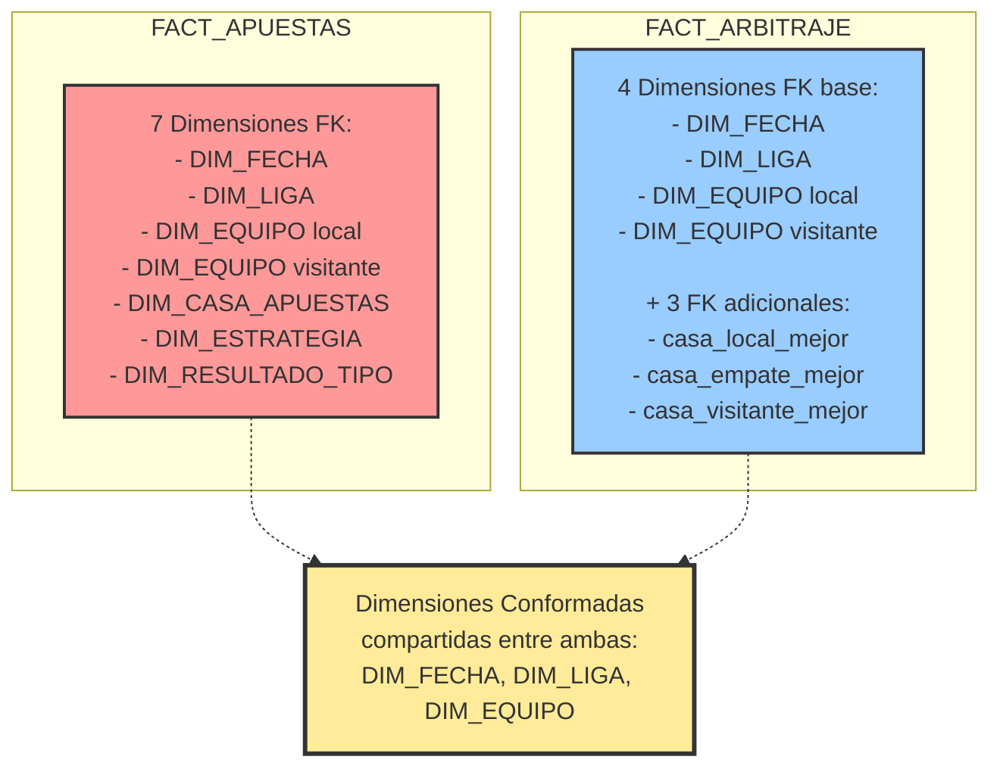

### Granularidad Comparada

```mermaid
graph TB
    subgraph "FACT_APUESTAS - Granularidad FINA"
        FA_G[Nivel: Apuesta Individual<br/><br/>1 registro =<br/>1 partido ×<br/>1 casa de apuestas ×<br/>1 estrategia ×<br/>1 tipo resultado<br/><br/>Permite análisis:<br/>- Por estrategia específica<br/>- Por casa individual<br/>- Por tipo resultado]
    end

    subgraph "FACT_ARBITRAJE - Granularidad GRUESA"
        FAR_G[Nivel: Partido Completo<br/><br/>1 registro =<br/>1 partido<br/>(análisis cross-casa)<br/><br/>Permite análisis:<br/>- Oportunidades arbitraje<br/>- Mejores cuotas mercado<br/>- Comparación casas]
    end

    style FA_G fill:#ff9999,stroke:#333,stroke-width:2px
    style FAR_G fill:#99ccff,stroke:#333,stroke-width:2px
```

### Métricas y Tipos

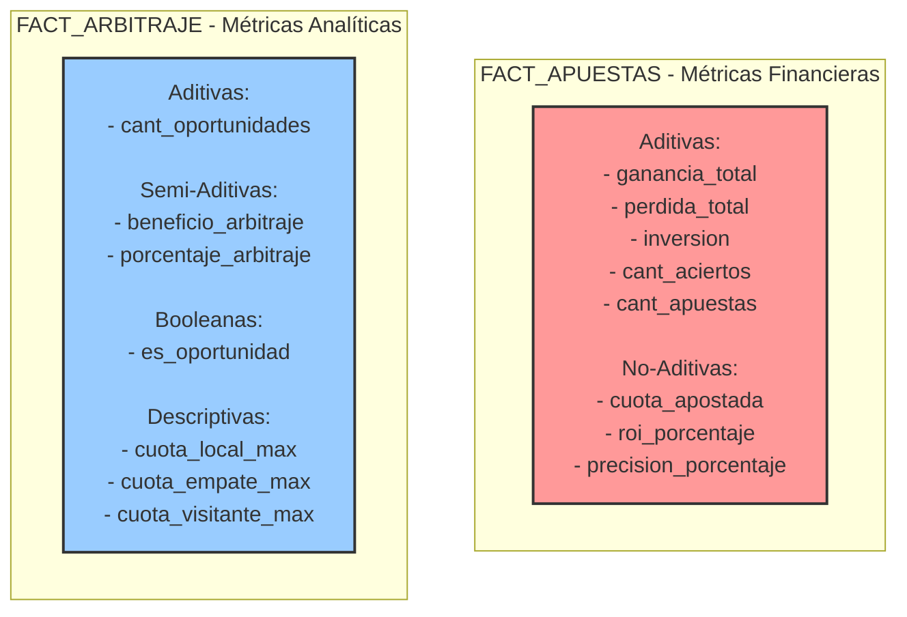

### Ventaja de Performance

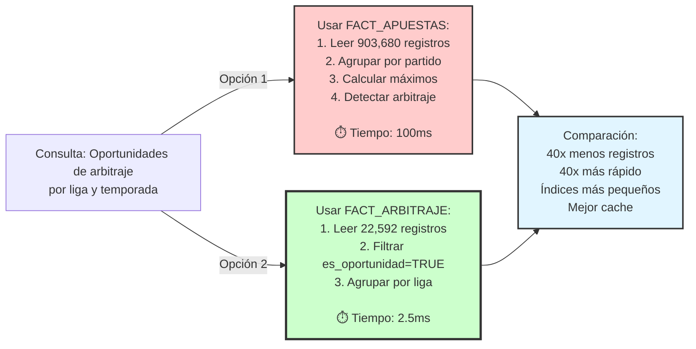

---

## Matriz de Indicadores vs Tablas de Hechos

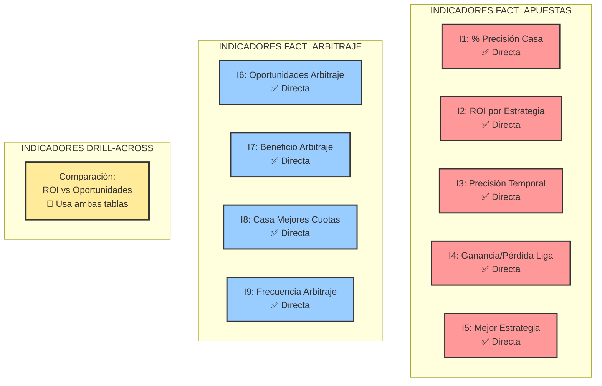

### Tabla de Uso de Indicadores

| Indicador | Tabla Principal | Métrica Usada | Complejidad Query |
|-----------|----------------|---------------|-------------------|
| I1: % Precisión Casa | FACT_APUESTAS | cant_aciertos / cant_apuestas | Baja |
| I2: ROI Estrategia | FACT_APUESTAS | (ganancia - perdida) / inversion | Baja |
| I3: Precisión Temporal | FACT_APUESTAS | cant_aciertos / cant_apuestas + DIM_FECHA | Media |
| I4: Ganancia/Pérdida Liga | FACT_APUESTAS | SUM(ganancia - perdida) + DIM_LIGA | Baja |
| I5: Mejor Estrategia | FACT_APUESTAS | MAX(ROI) GROUP BY estrategia | Media |
| I6: Oportunidades Arbitraje | FACT_ARBITRAJE | COUNT WHERE es_oportunidad | Baja |
| I7: Beneficio Arbitraje | FACT_ARBITRAJE | AVG(beneficio_arbitraje) | Baja |
| I8: Casa Mejores Cuotas | FACT_ARBITRAJE | COUNT(casa_mejor) | Baja |
| I9: Frecuencia por Liga | FACT_ARBITRAJE | COUNT + DIM_LIGA | Baja |

---

## Resumen de Diseño de Tablas de Hechos

### Decisión Arquitectónica: Dos Tablas vs Una

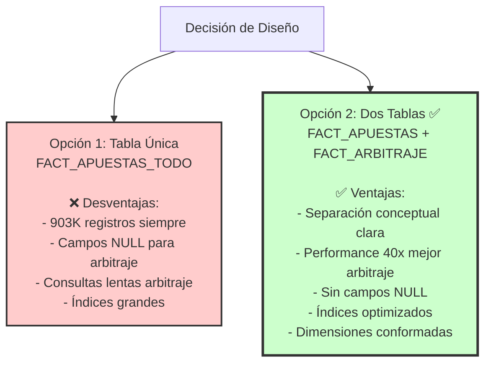

### Métricas de Decisión

| Métrica | Tabla Única | Dos Tablas (Constelación) |
|---------|-------------|---------------------------|
| **Registros totales** | ~903,680 | 903,680 + 22,592 = 926,272 |
| **Almacenamiento** | ~180 MB | ~185 MB (+2.7%) |
| **Campos NULL** | ~25% valores NULL | 0% valores NULL |
| **Performance arbitraje** | 100 ms | 2.5 ms (40x mejor) |
| **Índices** | 7 índices grandes | 7 + 4 índices especializados |
| **Complejidad consultas** | Media-Alta | Baja |
| **Mantenibilidad** | Media | Alta |

---

**Diagrama 3c - Tablas de Hechos Completo** ✅
