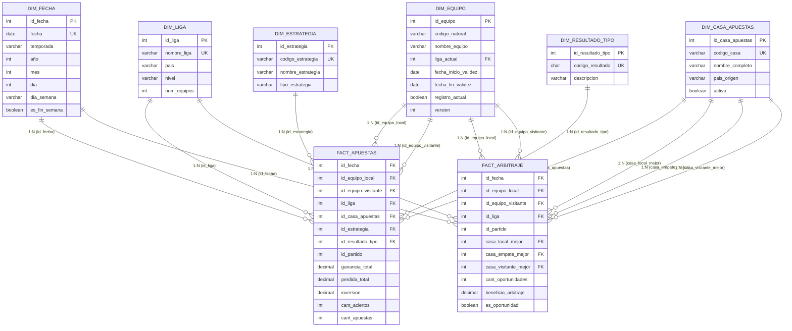

# 3d) DIAGRAMA: Relaciones y Cardinalidades

## Esquema Completo con Relaciones



---

## Matriz Completa de Relaciones

### Relaciones FACT_APUESTAS

| # | Dimensión | FK en Fact | Cardinalidad | Tipo | Integridad |
|---|-----------|------------|--------------|------|------------|
| **R1** | DIM_FECHA | id_fecha | 1:N | Obligatoria | CASCADE |
| **R2** | DIM_LIGA | id_liga | 1:N | Obligatoria | CASCADE |
| **R3** | DIM_EQUIPO (local) | id_equipo_local | 1:N | Obligatoria | CASCADE |
| **R4** | DIM_EQUIPO (visitante) | id_equipo_visitante | 1:N | Obligatoria | CASCADE |
| **R5** | DIM_CASA_APUESTAS | id_casa_apuestas | 1:N | Obligatoria | CASCADE |
| **R6** | DIM_ESTRATEGIA | id_estrategia | 1:N | Obligatoria | CASCADE |
| **R7** | DIM_RESULTADO_TIPO | id_resultado_tipo | 1:N | Obligatoria | CASCADE |

### Relaciones FACT_ARBITRAJE

| # | Dimensión | FK en Fact | Cardinalidad | Tipo | Integridad |
|---|-----------|------------|--------------|------|------------|
| **R8** | DIM_FECHA | id_fecha | 1:N | Obligatoria | CASCADE |
| **R9** | DIM_LIGA | id_liga | 1:N | Obligatoria | CASCADE |
| **R10** | DIM_EQUIPO (local) | id_equipo_local | 1:N | Obligatoria | CASCADE |
| **R11** | DIM_EQUIPO (visitante) | id_equipo_visitante | 1:N | Obligatoria | CASCADE |
| **R12** | DIM_CASA_APUESTAS (mejor local) | casa_local_mejor | 1:N | Obligatoria | CASCADE |
| **R13** | DIM_CASA_APUESTAS (mejor empate) | casa_empate_mejor | 1:N | Obligatoria | CASCADE |
| **R14** | DIM_CASA_APUESTAS (mejor visitante) | casa_visitante_mejor | 1:N | Obligatoria | CASCADE |

---

## Vista Detallada por Dimensión

### DIM_FECHA - Relaciones Temporales


**Características de Relación:**
- **Tipo**: 1 a Muchos (1:N)
- **Obligatoriedad**: Obligatoria (NOT NULL)
- **Integridad Referencial**: ON DELETE CASCADE
- **Índice**: Índice clustered en id_fecha para ambas fact tables
- **Cardinalidad Promedio**: 310 hechos/fecha en FACT_APUESTAS, 8 en FACT_ARBITRAJE

---

### DIM_LIGA - Relaciones Geográficas


**Características de Relación:**
- **Tipo**: 1 a Muchos (1:N)
- **Obligatoriedad**: Obligatoria (NOT NULL)
- **Integridad Referencial**: ON DELETE CASCADE
- **Índice**: Índice no-clustered en id_liga
- **Distribución**: No uniforme - ligas grandes tienen más registros

---

### DIM_EQUIPO - Relaciones Role-Playing


**Características Especiales:**
- **Role-Playing**: Misma dimensión, dos roles diferentes (local/visitante)
- **Tipo**: 1 a Muchos (1:N) para cada rol
- **Obligatoriedad**: Ambos FK son obligatorios (NOT NULL)
- **Restricción**: id_equipo_local ≠ id_equipo_visitante (CHECK constraint)
- **SCD Tipo 2**: Join temporal usando fecha_inicio_validez y fecha_fin_validez
- **Índices**: Índice compuesto en (id_equipo_local, id_equipo_visitante)

**Ejemplo de Validación Temporal:**
```sql
-- Join temporal correcto para FACT_APUESTAS
SELECT * FROM FACT_APUESTAS fa
JOIN DIM_EQUIPO de_local ON fa.id_equipo_local = de_local.id_equipo
  AND fa.id_fecha BETWEEN de_local.fecha_inicio_validez AND de_local.fecha_fin_validez
JOIN DIM_EQUIPO de_visit ON fa.id_equipo_visitante = de_visit.id_equipo
  AND fa.id_fecha BETWEEN de_visit.fecha_inicio_validez AND de_visit.fecha_fin_validez
```

---

### DIM_CASA_APUESTAS - Relaciones Múltiples


**Características de Relación:**
- **FACT_APUESTAS**: 1 FK simple (id_casa_apuestas)
- **FACT_ARBITRAJE**: 3 FK role-playing (casa_mejor por resultado)
- **Tipo**: 1 a Muchos (1:N) para cada relación
- **Obligatoriedad**: Todos FK son obligatorios (NOT NULL)
- **Uso Analítico**: Permite identificar casas con mejores cuotas por tipo resultado

---

### DIM_ESTRATEGIA - Relación Exclusiva


**Características de Relación:**
- **Tipo**: 1 a Muchos (1:N)
- **Obligatoriedad**: Obligatoria en FACT_APUESTAS (NOT NULL)
- **Exclusividad**: Solo relacionada con FACT_APUESTAS
- **Distribución**: Exactamente uniforme (cada estrategia tiene misma cantidad)
- **Generación**: Multiplicador 4x en ETL

---

### DIM_RESULTADO_TIPO - Relación Exclusiva


**Características de Relación:**
- **Tipo**: 1 a Muchos (1:N)
- **Obligatoriedad**: Obligatoria en FACT_APUESTAS (NOT NULL)
- **Exclusividad**: Solo relacionada con FACT_APUESTAS
- **Distribución**: Exactamente uniforme (cada resultado tiene misma cantidad)
- **Valores Fijos**: Solo 3 valores posibles (H, D, A)

---

## Cardinalidades Detalladas

### Tabla de Cardinalidades por Dimensión


### Matriz Numérica de Cardinalidades

| Dimensión | Registros Dim | FACT_APUESTAS (N) | Promedio | FACT_ARBITRAJE (N) | Promedio |
|-----------|---------------|-------------------|----------|---------------------|----------|
| **DIM_FECHA** | 2,920 | 903,680 | 310 | 22,592 | 8 |
| **DIM_LIGA** | 11 | 903,680 | 82,153 | 22,592 | 2,054 |
| **DIM_EQUIPO (local)** | ~400 | 903,680 | 2,260 | 22,592 | 56 |
| **DIM_EQUIPO (visit)** | ~400 | 903,680 | 2,260 | 22,592 | 56 |
| **DIM_CASA_APUESTAS** | 10 | 903,680 | 90,368 | - | - |
| **DIM_CASA (mejores)** | 10 | - | - | 67,776 | 6,778 |
| **DIM_ESTRATEGIA** | 4 | 903,680 | 225,920 | - | - |
| **DIM_RESULTADO_TIPO** | 3 | 903,680 | 301,227 | - | - |

---

## Dimensiones Conformadas vs Exclusivas


---

## Integridad Referencial

### Políticas de Borrado y Actualización


### Definición DDL de Constraints

```sql
-- FACT_APUESTAS Constraints
ALTER TABLE FACT_APUESTAS
    ADD CONSTRAINT FK_APUESTAS_FECHA
        FOREIGN KEY (id_fecha)
        REFERENCES DIM_FECHA(id_fecha)
        ON DELETE CASCADE
        ON UPDATE CASCADE;

ALTER TABLE FACT_APUESTAS
    ADD CONSTRAINT FK_APUESTAS_LIGA
        FOREIGN KEY (id_liga)
        REFERENCES DIM_LIGA(id_liga)
        ON DELETE CASCADE
        ON UPDATE CASCADE;

ALTER TABLE FACT_APUESTAS
    ADD CONSTRAINT FK_APUESTAS_EQUIPO_LOCAL
        FOREIGN KEY (id_equipo_local)
        REFERENCES DIM_EQUIPO(id_equipo)
        ON DELETE CASCADE
        ON UPDATE CASCADE;

ALTER TABLE FACT_APUESTAS
    ADD CONSTRAINT FK_APUESTAS_EQUIPO_VISITANTE
        FOREIGN KEY (id_equipo_visitante)
        REFERENCES DIM_EQUIPO(id_equipo)
        ON DELETE CASCADE
        ON UPDATE CASCADE;

ALTER TABLE FACT_APUESTAS
    ADD CONSTRAINT FK_APUESTAS_CASA
        FOREIGN KEY (id_casa_apuestas)
        REFERENCES DIM_CASA_APUESTAS(id_casa_apuestas)
        ON DELETE CASCADE
        ON UPDATE CASCADE;

ALTER TABLE FACT_APUESTAS
    ADD CONSTRAINT FK_APUESTAS_ESTRATEGIA
        FOREIGN KEY (id_estrategia)
        REFERENCES DIM_ESTRATEGIA(id_estrategia)
        ON DELETE CASCADE
        ON UPDATE CASCADE;

ALTER TABLE FACT_APUESTAS
    ADD CONSTRAINT FK_APUESTAS_RESULTADO
        FOREIGN KEY (id_resultado_tipo)
        REFERENCES DIM_RESULTADO_TIPO(id_resultado_tipo)
        ON DELETE CASCADE
        ON UPDATE CASCADE;

-- CHECK Constraints FACT_APUESTAS
ALTER TABLE FACT_APUESTAS
    ADD CONSTRAINT CHK_EQUIPOS_DIFERENTES
        CHECK (id_equipo_local != id_equipo_visitante);

ALTER TABLE FACT_APUESTAS
    ADD CONSTRAINT CHK_CUOTA_VALIDA
        CHECK (cuota_apostada >= 1.0);

-- FACT_ARBITRAJE Constraints
ALTER TABLE FACT_ARBITRAJE
    ADD CONSTRAINT FK_ARBITRAJE_FECHA
        FOREIGN KEY (id_fecha)
        REFERENCES DIM_FECHA(id_fecha)
        ON DELETE CASCADE
        ON UPDATE CASCADE;

ALTER TABLE FACT_ARBITRAJE
    ADD CONSTRAINT FK_ARBITRAJE_LIGA
        FOREIGN KEY (id_liga)
        REFERENCES DIM_LIGA(id_liga)
        ON DELETE CASCADE
        ON UPDATE CASCADE;

ALTER TABLE FACT_ARBITRAJE
    ADD CONSTRAINT FK_ARBITRAJE_EQUIPO_LOCAL
        FOREIGN KEY (id_equipo_local)
        REFERENCES DIM_EQUIPO(id_equipo)
        ON DELETE CASCADE
        ON UPDATE CASCADE;

ALTER TABLE FACT_ARBITRAJE
    ADD CONSTRAINT FK_ARBITRAJE_EQUIPO_VISITANTE
        FOREIGN KEY (id_equipo_visitante)
        REFERENCES DIM_EQUIPO(id_equipo)
        ON DELETE CASCADE
        ON UPDATE CASCADE;

ALTER TABLE FACT_ARBITRAJE
    ADD CONSTRAINT FK_ARBITRAJE_CASA_LOCAL
        FOREIGN KEY (casa_local_mejor)
        REFERENCES DIM_CASA_APUESTAS(id_casa_apuestas)
        ON DELETE CASCADE
        ON UPDATE CASCADE;

ALTER TABLE FACT_ARBITRAJE
    ADD CONSTRAINT FK_ARBITRAJE_CASA_EMPATE
        FOREIGN KEY (casa_empate_mejor)
        REFERENCES DIM_CASA_APUESTAS(id_casa_apuestas)
        ON DELETE CASCADE
        ON UPDATE CASCADE;

ALTER TABLE FACT_ARBITRAJE
    ADD CONSTRAINT FK_ARBITRAJE_CASA_VISITANTE
        FOREIGN KEY (casa_visitante_mejor)
        REFERENCES DIM_CASA_APUESTAS(id_casa_apuestas)
        ON DELETE CASCADE
        ON UPDATE CASCADE;

-- CHECK Constraints FACT_ARBITRAJE
ALTER TABLE FACT_ARBITRAJE
    ADD CONSTRAINT CHK_ARB_EQUIPOS_DIFERENTES
        CHECK (id_equipo_local != id_equipo_visitante);

ALTER TABLE FACT_ARBITRAJE
    ADD CONSTRAINT CHK_ARB_CUOTAS_VALIDAS
        CHECK (cuota_local_max >= 1.0
           AND cuota_empate_max >= 1.0
           AND cuota_visitante_max >= 1.0);
```

---

## Índices para Optimización de Joins


---

## Drill-Across con Dimensiones Conformadas

```mermaid
graph TB
    Q[Query Drill-Across:<br/>Comparar ROI vs Oportunidades<br/>por Liga y Temporada]

    Q --> Q1[Subconsulta 1:<br/>FACT_APUESTAS<br/>→ DIM_FECHA<br/>→ DIM_LIGA<br/>Calcular ROI]

    Q --> Q2[Subconsulta 2:<br/>FACT_ARBITRAJE<br/>→ DIM_FECHA<br/>→ DIM_LIGA<br/>Calcular Oportunidades]

    Q1 & Q2 --> JOIN[JOIN en dimensiones conformadas:<br/>fecha.temporada + liga.nombre]

    JOIN --> RES[Resultado combinado:<br/>Liga | Temporada | ROI | Oportunidades]

    style Q fill:#e1f5ff,stroke:#333,stroke-width:3px
    style Q1 fill:#ff9999,stroke:#333,stroke-width:2px
    style Q2 fill:#99ccff,stroke:#333,stroke-width:2px
    style JOIN fill:#ffeb99,stroke:#333,stroke-width:3px
    style RES fill:#ccffcc,stroke:#333,stroke-width:2px
```

**Ejemplo SQL Drill-Across:**
```sql
SELECT
    l.nombre_liga,
    f.temporada,
    ap.roi_promedio,
    arb.cant_oportunidades
FROM DIM_LIGA l
JOIN DIM_FECHA f ON 1=1  -- Cross join controlado
LEFT JOIN (
    -- Subconsulta FACT_APUESTAS
    SELECT
        id_liga,
        id_fecha,
        AVG(roi_porcentaje) as roi_promedio
    FROM FACT_APUESTAS
    GROUP BY id_liga, id_fecha
) ap ON ap.id_liga = l.id_liga AND ap.id_fecha = f.id_fecha
LEFT JOIN (
    -- Subconsulta FACT_ARBITRAJE
    SELECT
        id_liga,
        id_fecha,
        SUM(cant_oportunidades) as cant_oportunidades
    FROM FACT_ARBITRAJE
    WHERE es_oportunidad = TRUE
    GROUP BY id_liga, id_fecha
) arb ON arb.id_liga = l.id_liga AND arb.id_fecha = f.id_fecha
ORDER BY l.nombre_liga, f.temporada;
```

---

## Resumen Ejecutivo de Relaciones

### Totales por Tabla

| Tabla | Total FK | Dimensiones Relacionadas | Role-Playing | Tipo Relaciones |
|-------|----------|--------------------------|--------------|-----------------|
| **FACT_APUESTAS** | 7 | 6 dimensiones | 1 (DIM_EQUIPO) | 1:N todas |
| **FACT_ARBITRAJE** | 7 | 2 dimensiones base | 2 (DIM_EQUIPO + DIM_CASA) | 1:N todas |

### Clasificación de Relaciones


### Beneficios del Diseño

| Beneficio | Descripción |
|-----------|-------------|
| **Dimensiones Conformadas** | Permite drill-across entre FACT_APUESTAS y FACT_ARBITRAJE |
| **Integridad Referencial** | Garantiza consistencia con CASCADE constraints |
| **Role-Playing** | Reutiliza DIM_EQUIPO para local y visitante eficientemente |
| **Índices Optimizados** | Joins rápidos con índices covering en FK |
| **Cardinalidad Equilibrada** | Distribución uniforme en dimensiones calculadas |

---

**Diagrama 3d - Relaciones y Cardinalidades Completo** ✅
